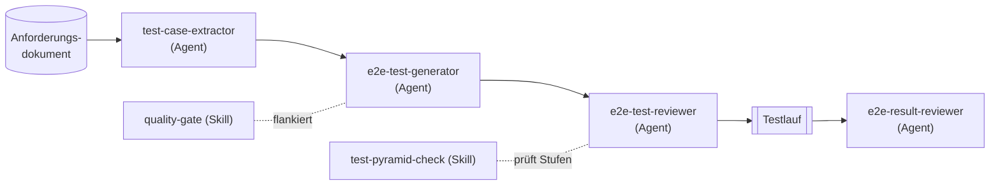

Das Repo [`kamerplanter`](https://github.com/nolte/kamerplanter) trägt 70 Selenium-End-to-End-Testdateien, gestützt auf 58 Page-Object-Klassen, dazu eine pytest-Suite im Backend und eine vitest-Suite im Frontend. Den allergrößten Teil dieses Testcodes habe ich nicht selbst geschrieben. Claude-Code-Agents haben ihn anhand einer Spec angelegt, gegen dieselbe Spec geprüft und die Ergebnisse zurückgelesen — eine Stufe nach der anderen.

Dieser Beitrag eröffnet eine fünfteilige Serie über genau diesen Ablauf. Die Behauptung dahinter ist eng: Der wiederverwendbare Teil der Testautomatisierung ist nicht der Testcode. Es ist die Disziplin, die eine Suite vertrauenswürdig hält — Testfälle aus Anforderungen ableiten, Suites jedes Mal gleich aufbauen, sie gegen feste Regeln prüfen und die Ergebnisse ehrlich lesen. Diese Disziplin wiederholt sich, und genau das macht sie zu einer guten Aufgabe für einen Agenten. Die Grenzen — was jede Stufe prüfen darf, wann man aufhört, Abdeckung nach unten zu schieben — bleiben bei der Spec und bei mir.

## Die Pyramide ist Verantwortung, kein Gewicht

Die Serie geht die vier Stufen durch, die `spec/project/e2e-test-automation/` in meinem geteilten Plugin [`nolte/claude-shared`](https://github.com/nolte/claude-shared) (Stand `v0.1.5`) definiert: Unit, Integration, Contract/API und End-to-End.

Das interessante Wort an der Testpyramide ist nicht die Form. Es ist die Schichtung. Jede Stufe besitzt eine Art von Fehler, die eine Stufe darunter schlechter fangen würde.

Unit-Tests nageln Geschäftslogik isoliert fest. Integrationstests decken kritische Pfade mit echten Abhängigkeiten ab. Contract-Tests sichern jeden API-Endpunkt — sofern das System einen anbietet. End-to-End-Tests laufen Nutzerpfade durch die echte Oberfläche ab.

Die Spec sagt die Regel klar: Die Tests eines Features müssen die zutreffenden Stufen abdecken, statt Abdeckung in langsame Browsertests zu stapeln, und die E2E-Stufe ist der Prüfung von Nutzerpfaden vorbehalten — nicht der Logik, die eine schnellere Stufe festnagelt. Diese eine Regel verhindert, dass eine Suite zu einem Haufen brüchiger Klicks verkommt.

## Eine Kette von Agents pro Feature

Das geteilte Plugin macht aus diesen Stufen eine Pipeline. Jedes Glied ist ein Claude-Code-Agent oder -Skill mit einer eng umrissenen Aufgabe:

Die Kette liest sich von links nach rechts. `test-case-extractor` macht aus einer Anforderung framework-agnostische Testfälle — nur beobachtbares Nutzerverhalten, keine HTTP-Codes, kein Datenbankzustand. `e2e-test-generator` legt aus diesen Fällen eine spec-konforme Suite an. `e2e-test-reviewer` benotet eine bestehende Suite und nimmt minimale Korrekturen vor, die die ursprüngliche Absicht wahren — er repariert, er erzeugt nicht neu. Nach einem Lauf liest `e2e-result-reviewer` die Screenshots und das Protokoll wie ein menschlicher Prüfer und meldet Befunde, die an die jeweilige Testfall-ID geknüpft sind.

Zwei Skills flankieren die Kette, statt in ihr zu sitzen. `quality-gate` führt Linting, Typecheck und Tests zusammen aus und listet auf, was fehlgeschlagen ist. `test-pyramid-check` prüft, ob die zutreffenden Stufen überhaupt vorhanden sind — und markiert eine fehlende Stufe als Lücke oder hält eine Stufe, die wirklich nicht zutrifft, als `n/a` mit Begründung fest.

Was mir an dieser Aufteilung gefällt: Jeder Agent hat eine Verantwortung und ein festes Werkzeug-Set. Der Generator darf Testdateien schreiben, fasst aber nie die App an, um einen fehlenden Hook zu ergänzen. Der Result-Reviewer ist read-only — er beurteilt einen fertigen Lauf und kann ihn nicht erneut starten, damit ein Befund verschwindet.

## Framework-neutral, mit einem Referenzprofil

Die Spec ist vorsichtig bei einer Falle, in die ich früher selbst getappt bin: einen einzigen Test-Stack fest in die Regeln zu verdrahten. Der bindende Kern — Page Objects, deterministisches Warten, eine Locator-Hierarchie, Screenshot-Checkpoints, ein maschinell geschriebenes Protokoll, Spec-Rückverfolgbarkeit — kommt ohne Nennung einer Bibliothek aus. Selenium plus pytest ist das normative Referenzprofil für Python-Projekte, kein Zwang. Setz Playwright oder Cypress ein, und dieselben sechs Disziplinen gelten weiter.

Den ganzen E2E-Artikel werde ich diesen sechs Disziplinen widmen. Für den Moment hier die Kurzfassung der Locator-Regel, weil sie die ist, die die meisten Teams falsch machen: Bevorzuge `data-testid`, dann eine Element-ID, dann einen semantischen oder Rollen-Selektor, dann CSS und erst danach XPath — wobei positionsbasiertes XPath ganz ausgeschlossen ist.

## Wie das in einem echten Repo aussieht

`kamerplanter` ist das durchgehende Beispiel der Serie. Es ist ein selbstgehostetes System für den Pflanzen-Lebenszyklus: ein Backend aus Python und FastAPI, ein Frontend aus React und TypeScript und eine E2E-Schicht auf Selenium. Der Testcode ist echt, und die Zahlen, die ich nenne, sind es auch.

Die E2E-Suite trägt 70 `test_req*.py`-Dateien und 58 Page-Object-Klassen. Jeder Test verweist über eine ID zurück auf einen Spec-Testfall — ein Docstring wie `TC-REQ-002-001` zeigt auf `TC-002-001` im Testfall-Dokument der Anforderung. Ein Lauf schreibt Screenshots an benannten Checkpoints und ein Markdown-Protokoll mit Metadaten, einer Bestanden/Fehlgeschlagen-Übersicht und der Abdeckung je Anforderung. Nichts davon ist nachträglich angeschraubt; es ist das, was der Generator anlegt und worauf der Reviewer prüft.

Das Repo hält außerdem projekteigene Claude-Agents neben den geteilten — `unit-test-runner`, `selenium-test-generator`, `e2e-testcase-extractor`. Sie sind älter als das geteilte Plugin und erledigen dieselben Aufgaben, eine Stufe nach der anderen. Ein Teil dieser Serie ist die Geschichte, wie die lokalen Fassungen in die geteilte Spec übergehen.

## Der ehrliche Teil: die Pyramide steht schief

Würde ich dir nur die E2E-Zahlen zeigen, verkaufte ich dir eine saubere Pyramide, die es nicht gibt. Die echte Form in `kamerplanter` steht schief. Die Integrationsstufe ist eine einzige Datei, und sie läuft nicht in der CI, weil sie eine echte Datenbank braucht. Vier Dateien bilden die Contract/API-Stufe — auch sie führt der übliche Backend-CI-Job nicht aus; er führt nur die Unit-Stufe aus.

Das lasse ich bewusst so stehen. Die Pyramide, die ein Agent dir bauen hilft, ist die Pyramide, die dein Projekt wirklich hat, nicht das Diagramm auf einer Folie. Eine Stufe, die aus einem echten Grund dünn ist, ist ehrlicher als eine Stufe, die man aufpolstert, damit sie ausgewogen wirkt. Jeder Stufen-Artikel wird sagen, wo das Beispiel stark ist, wo es dünn ist und was ein Agent dagegen tun kann — und was nicht.

## Wie es weitergeht

Vier Artikel folgen auf diesen, einer je Stufe:

- **Unit** — die schnelle Stufe: pytest und vitest, der Agent `unit-test-runner` und der Skill `quality-gate`.
- **Integration** — kritische Pfade mit echten Abhängigkeiten, und warum diese Stufe dünn bleibt.
- **Contract/API** — jeden Endpunkt absichern, und die Lücke zwischen „Tests existieren“ und „Tests laufen in der CI“.
- **E2E** — die sechs Disziplinen in voller Länge: Page Objects, Warten, Locators, Screenshots, das Protokoll und die Rückverfolgbarkeit.

Der rote Faden durch alle vier ist derselbe wie hier. Der Agent übernimmt die wiederholbare Disziplin. Die Spec — und der Mensch, der den Diff liest — entscheidet, wofür diese Disziplin da ist.
