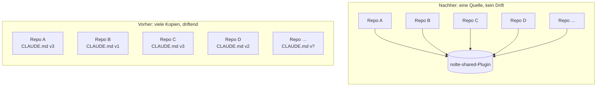

Ich nutze Claude Code in rund einem Dutzend Repos — diesem Blog, Home-Automation-Tools, Ansible-Playbooks, Cookiecutter-Templates. Bis vor ein paar Monaten lebten die Workflows, die Claude in jedem davon brauchte, im jeweiligen `CLAUDE.md` des Repos, und das hörte auf zu funktionieren. Die geteilte Baseline liegt jetzt an einer Stelle: in einem Plugin namens `nolte-shared`, Quelle unter [`nolte/claude-shared`](https://github.com/nolte/claude-shared). Dieser Post ist das Warum hinter der Extraktion und das, was tatsächlich drin steckt.

## Der Drift, den du nicht siehst, bevor er beißt

Eine Zeit lang fühlte sich die Duplikation in Ordnung an. Ich schrieb einen `## Pull request conventions`-Block in das `CLAUDE.md` eines Repos, kopierte ihn ins nächste, passte ein paar Zeilen an, machte weiter. Die Repos funktionierten. Jede Claude-Session hatte, was sie brauchte.

Das Problem zeigte sich beim dritten Mal, als ich etwas ändern musste. Ich hatte eine strengere PR-Titel-Regel in einem Repo eingeführt (Conventional Commits mit Pflicht-Scope), und Claude in jenem Repo hielt sich daran. In den anderen Repos schlug Claude weiterhin schlichte `feat: ...`-Titel vor, weil die duplizierten Blöcke ein Quartal alt waren und niemand sie aktualisiert hatte. Derselbe Drift versteckte sich in den Review-Prompts und in den Vale-Vokabular-Verweisen — eine Baseline, der ich nicht mehr traute.

Visuell sieht der Wechsel von einem Dutzend driftenden Kopien zu einem Plugin so aus:

Dieselbe Menge Repos in beiden Fällen. Der Unterschied: ob die Workflows, die sie teilen, an einer Stelle oder an zwölf wohnen.

## Was `nolte-shared` tatsächlich enthält

Das Plugin liegt unter [`nolte/claude-shared`](https://github.com/nolte/claude-shared) auf Commit `fc0ef69`, während ich das schreibe, in Version `0.1.3`. Es liefert drei Kategorien von Artefakten:

- **Skills** unter `skills/<name>/SKILL.md` — aufrufbar als `/nolte-shared:<name>`. Beispiele: `pull-request-create`, `pull-request-merge`, `quality-gate`, `dependency-audit`, `skill-management`, `spec`.
- **Agents** unter `agents/<name>.md` — fokussierte Sub-Agents mit engerem Tool-Zugriff, dispatched von Skills oder über das `Task`-Tool. Beispiele: `claude-plugin-developer`, `prose-vale-curator`, `docs-freshness-checker`.
- **Spezifikationen** unter `spec/` — zweisprachiges Markdown (kanonisch Englisch, deutsche Übersetzung im Lockstep) beschreibt den Vertrag, den jede Skill oder jeder Agent implementiert.

Was das mehr macht als eine `CLAUDE.md`-Sammlung, ist der dritte Topf. Jede Skill im Plugin hat eine Spec, die sie implementiert. Driftet die Skill von ihrer Spec, fängt das die `skill-review`-Skill ab und schreibt einen ausführbaren Review-Plan; widerspricht die Spec einer anderen, flaggt das der `spec-readiness-reviewer`. Die [Plugin-Dokumentation](https://docs.claude.com/en/docs/claude-code/plugins) von Claude Code übernimmt die Distribution; die Specs übernehmen die Korrektheit.

## Warum ein Plugin und nicht die Alternativen

Drei andere Formen habe ich erwogen, bevor ich beim Plugin gelandet bin.

Ein Git-Submodule, das die geteilten `CLAUDE.md`-Fragmente in jedes Repo eingehängt hätte, hätte die Dateien lokal gehalten. Aber `git submodule update` ist, nach meiner Erfahrung, einer der schmerzhaftesten Workflows im Git-Tooling, und Submodules versionieren Code, nicht Capabilities. Jedes Repo hätte einen konkreten SHA gepinnt, und Updates wären eine ständige Pflicht gewesen.

Ein simples Copy-Script, das `~/.claude/skills/` aus einem zentralen Repo synchronisiert, überschritt eine harte Grenze. Die `skill-management`-Spec unter `spec/claude/skill-management/` ist eindeutig: Plugin-eigene Skills dürfen nicht durch Kopieren oder Symlinking in das `.claude/skills/` eines Konsumenten verteilt werden. Distribution ist die Aufgabe des Plugin-Mechanismus, und der Grund ist genau das Drift-Problem von oben — eine Kopie ist eine veraltete Kopie ab dem Moment, in dem sie landet.

Ein Monorepo, das die geteilten Bestandteile plus alle Konsumer-Projekte enthält, hätte zwölf Repositories zu einem zusammengefaltet. Die Claude-Seite wäre konsistent geblieben — aber alles andere (CI-Scope, Release-Kadenz, Dependency-Upgrades, GitHub-Actions-Kosten) wäre schlechter geworden. Die Claude-Baseline zu teilen rechtfertigt es nicht, alles andere zu teilen.

Ein Plugin gibt mir drei Dinge auf einmal: einen Marketplace-Installations-Pfad für normale Konsumenten (`/plugin install nolte-shared@nolte-shared`), eine versionierte `.claude-plugin/plugin.json`, die der Release-Workflow bei jedem Tag aktualisiert, und einen Dev-Mode-Loop (`claude --plugin-dir /pfad/zu/claude-shared` plus `/reload-plugins`), um am Plugin aus dem Plugin-eigenen Repo heraus zu iterieren. Dieser letzte Loop — das Plugin nutzen, um das Plugin zu entwickeln — ist das, was das Ganze tragfähig macht.

## Dogfooding: das Plugin entwickelt sich selbst

Das `claude-shared`-Repo wendet seine eigenen Specs auf sich selbst an. Seine Roadmap (`project/roadmap.md`) folgt `spec/project/roadmap/`; die `sprint-execute`-Skill verwaltet seine Sprints (`project/sprints/`); `pull-request-create` öffnet seine Pull Requests und `pull-request-merge` landet sie, beide nach `spec/project/pull-request-workflow/`. Die Spec regelt das Repo; die Skill setzt die Spec durch; beide werden im selben Plugin ausgeliefert.

Das ist der billigste Reality-Check, den ich kenne. Ist eine Spec nicht praktikabel, fällt sie zuerst hier auseinander, im Repo, das sie besitzt; produziert eine Skill ungelenke Ausgaben, merke ich es beim nächsten PR, den ich öffne, nicht beim nächsten Konsumenten, der sie installiert. Der Fix landet im selben PR — mit der Spec, mit der Skill, mit dem Beispiel. Roadmap-Item `R-1` („Planning-suite dogfood adoption complete“) ist die explizite Verpflichtung, das so beizubehalten, bevor irgendetwas in Konsumer-Repos wandert.

## Außerhalb des Umfangs und was als Nächstes kommt

Ein paar Dinge deckt dieser Post bewusst nicht ab.

Die Release-Pipeline — der Weg vom `develop`-Merge zu einem veröffentlichten `v0.1.4`, das Konsumenten installieren können — läuft als `R-2` auf der Roadmap, blockiert durch eine kleine `ci.yml`-`workflow_dispatch`-Lücke. Bis die geschlossen ist, funktioniert der Marketplace-Pfad für Releases, die ich manuell publiziere; der `--plugin-dir`-Loop deckt alles andere ab.

Der Spec-Korpus trägt durchgängig noch `Status: draft`. Das liegt nicht daran, dass die Specs unfertig wären — sie beschreiben echten laufenden Code —, sondern daran, dass der Schritt von `draft` zu `accepted` ein bewusstes Gate ist, das ich explizit machen will, kein Default. Einige Specs sind nah dran; andere bleiben eine Weile `draft`, weil sie offene Fragen tragen, die ich noch nicht beantwortet habe.

Wer sehen will, wie ein selbst-angewandtes Plugin in der Praxis aussieht, steigt am besten über die [`README`](https://github.com/nolte/claude-shared#readme) ein; das interessantere Lesematerial liegt unter [`spec/claude/`](https://github.com/nolte/claude-shared/tree/develop/spec/claude/), wo die Verträge wohnen.
