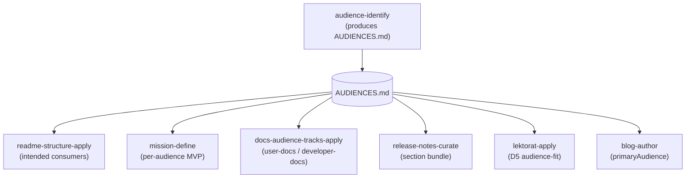

Öffne irgendeine README, die ich im letzten Jahr geschrieben habe, und weit oben steht eine Zeile dazu, für wen sie gedacht ist. Diese Zeile ist keine Deko. Sie ist das Ergebnis eines Schritts, den ich erledige, bevor die README überhaupt existiert: Ich lege zuerst die Zielgruppen des Projekts fest, schreibe sie auf und entscheide erst dann, was jede Doku, jede Spec und jede Release-Note sagen soll. In diesem Beitrag geht es um diesen Schritt — was er hervorbringt, welche Werkzeuge von ihm abhängen und warum sein Auslassen alles Nachgelagerte still und leise kaputtmacht.

Die Methode steckt in einer Spec meines geteilten Claude-Code-Plugins [`nolte-shared`](https://github.com/nolte/claude-shared), unter `spec/project/audience-identification/`. Falls du das Plugin noch nicht kennst: Der [Baseline-Beitrag](/de/blog/claude-shared-baseline) erklärt, warum ein einziges geteiltes Plugin über allen Repos liegt. Hier geht es um einen Prozess darin: den Leser zu benennen.

## Das Problem, das sie löst

Ein Projekt wird von mehr als einer Gruppe gelesen, betrieben, erweitert und eingeschränkt. Eine Bibliothek hat Leute, die sie aufrufen, und Leute, die sie paketieren. Ein Dienst hat Nutzer, den Betreiber, der ihn hostet, und vielleicht einen Compliance-Prüfer, der den Code nie anfasst. Genau da setzt die Spec an: Ohne ein diszipliniertes Verfahren, um Zielgruppen aufzuzählen, fallen Entscheidungen über Doku-Tiefe, API-Umfang und Release-Takt auf die privaten Annahmen des Autors zurück.

Dieser letzte Halbsatz ist das ganze Problem. „Private Annahmen“ heißt: Die Zielgruppe lebt nur in meinem Kopf. Die README erscheint in einer Tiefe, die ich geraten habe. Die Release-Note spricht zu einem Leser, den ich nie benannt habe. Niemand kann die Annahme prüfen, weil sie nie aufgeschrieben wurde.

Die Lösung ist fast langweilig: Schreib die Zielgruppe zuerst auf. Mach sie zu einem Artefakt, auf das andere Arbeit verweisen kann.

## Was „Zielgruppen definieren“ wirklich heißt

Das ist keine Marketing-Persona und keine demografische Gruppe. Die Spec ist streng bei der Form, und genau diese Strenge macht die Liste wiederverwendbar.

Sie **beginnt mit einem abgegrenzten Kontext** — einer schriftlichen Erklärung, was das Projekt *ist*, wo seine Grenzen verlaufen und was außerhalb liegt. Du kannst die Zielgruppen eines Projekts nicht auflisten, bevor du gesagt hast, was das Projekt ist. Deshalb öffnet das Artefakt mit „innerhalb der Grenze“ und „außerhalb der Grenze“, bevor ein einziger Leser benannt wird.

Dann **zählt sie Zielgruppen unter fünf Beziehungs-Kategorien auf**, und jede Kategorie, die nicht zutrifft, wird als „none“ festgehalten — mit Begründung, nie stillschweigend weggelassen:

- **Direkte Konsumenten** — wer die Schnittstelle aufruft (ein Mensch, ein anderer Dienst, eine nachgelagerte Bibliothek).
- **Betreiber** — wer es ausführt, deployt oder hostet.
- **Mitwirkende / Maintainer** — wer den Code ändert oder seine Inhalte schreibt.
- **Steuernde Parteien** — Recht, Compliance, Sicherheit oder Architektur-Review mit der Befugnis, Auflagen zu machen.
- **Indirekte Zielgruppen** — Menschen, die betroffen sind, ohne es je anzufassen, etwa die Endnutzer hinter einem Dienst, den ich selbst nutze.

Jede Zielgruppe, die es auf die Liste schafft, trägt dieselben Felder: ein kurzes Label, ihre Kategorie, die Oberfläche, über die sie interagiert (API, CLI, Dashboard, RSS-Feed), was sie erwartet, den Doku-`track`, dem sie zugeordnet ist, und jede offene Frage. Und jede ist mit `confirmed` markiert — geprüft an einem echten Vertreter oder einer belastbaren Quelle — oder mit `assumed`, von mir nur vermutet. Dieses eine Tag hält die Liste ehrlich darüber, was ich wirklich weiß und was ich nur rate.

## Wie das in der Praxis aussieht

Dieser Blog hat seine eigene Zielgruppen-Liste, in `AUDIENCES.md` im Wurzelverzeichnis des Repos. Sie ist das durchgearbeitete Beispiel für alles oben.

Der abgegrenzte Kontext sagt, was die Seite ist: ein zweisprachiger Astro-Blog, der zugleich als persönliche Wissensbasis dient und nach GitHub Pages deployt. Dann die Zielgruppen. Direkte Konsumenten sind technische Leser (**A**), Portfolio-Prüfer (**B**) und ich, wenn ich später meine eigene Wissensbasis lese (**C**). Betreiber bin ich als Seiten-Maintainer (**D**), dazu Claude Code als mein Co-Autor (**E**). Mitwirkende sind als „none — strictly personal blog“ festgehalten. Steuernde Parteien sind ebenfalls „none“ — aber mit einer offen geführten Frage, denn Regeln des EU AI Act zur Kennzeichnung synthetischer Inhalte könnten das ändern. Indirekte Zielgruppen sind die Menschen, die ich in Beiträgen benenne (**L**), und die Suchmaschinen- und LLM-Crawler, die sie indexieren (**M**).

Keiner dieser Einträge ist bisher `confirmed` — alle sind `assumed`, und die Datei sagt das offen. Das ist keine Schlampigkeit. Das ist die Spec bei der Arbeit: Ich habe keinen davon an echtem Traffic geprüft, also weigert sich die Liste, so zu tun, als hätte ich es.

## Wer die Liste nutzt — und warum sie zuerst da sein muss

Hier ist die Regel, die dem Ganzen Biss gibt. Die Zielgruppen-Liste muss existieren, bevor irgendein nachgelagertes Artefakt geschrieben wird, das eine Zielgruppe beansprucht. Die README, das Mission-Statement, die Roadmap, die Release-Notes, die Doku — jedes davon bedient einen Leser, also muss jedes auf die Liste verweisen, statt sich eine eigene auszudenken.

In meinem Plugin ist das keine Empfehlung, sondern Verdrahtung. Eine ganze Reihe von Skills und Agents liest dieselbe `AUDIENCES.md`:

Die Skill `audience-identify` bringt das Artefakt hervor. Alles andere nutzt es. `readme-structure-apply` baut daraus den Abschnitt „intended consumers“. `mission-define` fragt nach einem Ergebnis pro Zielgruppe. `docs-audience-tracks-apply` liest das `track`-Feld jeder Zielgruppe, um zu entscheiden, ob eine Seite für Nutzer oder für Entwickler gedacht ist. `release-notes-curate` schneidet seine Abschnitte auf die jeweiligen Leser zu. Selbst der Lektor, `lektorat-apply`, hat eine Dimension — D5, Audience-Fit —, die prüft, ob eine Seite wirklich zu dem Leser passt, den sie beansprucht.

Auch dieser Beitrag ist nachgelagert. Sein Frontmatter trägt `primaryAudience: A`, und die Autoren-Skill hat Tiefe und Einstieg aus der Rubrik dieser Zielgruppe gewählt — weil die Liste ihr gesagt hat, wer **A** ist.

## Warum es zählt, dass sie sich daran halten

Der Gewinn ist eine einzige Quelle der Wahrheit. Wenn sieben Werkzeuge dieselbe Datei lesen, ist der Leser einmal definiert und wird nie neu geraten. Ändere die Zielgruppen-Liste, und jeder Konsument ändert sich mit. Lass sie weg, und jedes Werkzeug fällt wieder auf eine private Vermutung zurück — genau das Versagen, das die Spec beseitigen wollte.

Drei kleinere Dinge sorgen dafür, dass die Disziplin hält:

**„none“ mit Begründung schlägt stilles Weglassen.** „contributors: none — personal blog“ zu schreiben ist eine festgehaltene Entscheidung. Die Kategorie leer zu lassen sieht auf der Seite identisch aus, heißt aber, dass ich nie darüber nachgedacht habe. Das Erste lässt sich prüfen, das Zweite nicht.

**`confirmed` gegen `assumed` bleibt ehrlich.** Eine Liste, die jede Vermutung klammheimlich zur Tatsache befördert, ist schlimmer als gar keine Liste. Jeden Eintrag zu markieren zwingt mich zuzugeben, was ich nicht geprüft habe — und gibt einem späteren Ich eine billige Aufgabe: die Annahmen bestätigen.

**Drift wird erkannt.** Die Zielgruppen-Liste liegt in Git neben dem Code, und eine eigene Skill, `spec-drift-audit`, meldet ein Projekt, dessen dokumentierte Zielgruppen nicht mehr zu seiner echten Interaktions-Oberfläche passen. Kommt eine öffentliche API oder ein Newsletter dazu, soll die Liste mitwachsen. Der Audit ist das, was bemerkt, wenn sie es nicht tat.

Nichts davon ist schwer. Das Artefakt ist eine einzige Markdown-Datei, und die Methode funktioniert auch im Kleinen — ein kleines Modul kann seine Zielgruppen in einen README-Abschnitt falten, statt in eine eigene Datei. Unverzichtbar bleibt allein die Reihenfolge: erst den Leser benennen, dann für ihn schreiben. Jede Doku, die ich ausliefere, ist nur so gut gezielt wie die Liste, auf die sie verweist.
