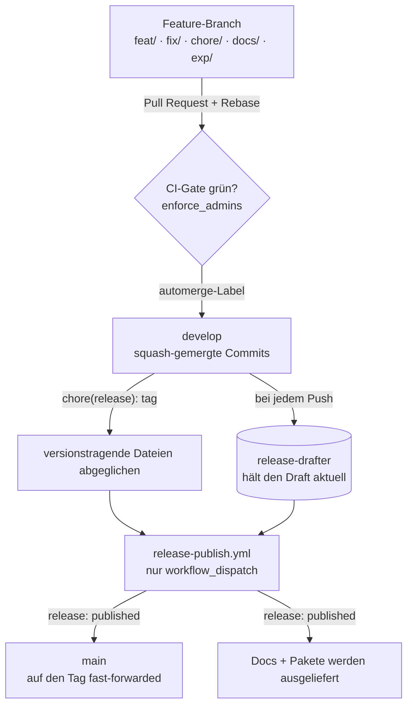

Wenn du `main` in einem meiner Repositories öffnest, siehst du keine laufende Arbeit. Du siehst genau das, was ich zuletzt released habe — nicht mehr und nicht weniger. Das ist kein Zufall und es liegt nicht an meiner Disziplin. Es ist das Ergebnis einer Pipeline, die jede Änderung über denselben festen Weg schickt: vom Feature-Branch bis zum veröffentlichten GitHub Release.

Dieser Beitrag geht diesen Weg Station für Station durch. Ich zeige die zwei Branches und ihre jeweilige Aufgabe, wie sich eine einzelne Änderung ihren Platz auf dem Integrationsbranch verdient, wie ein Release tatsächlich erzeugt wird und wie danach Pakete und Dokumentation ausgeliefert werden. Dieselbe Form wiederholt sich im ganzen Portfolio — wer sie einmal gesehen hat, liest jedes Repo gleich.

## Zwei Branches, zwei sehr verschiedene Aufgaben

Das ganze Modell beruht darauf, zwei Verantwortlichkeiten zu trennen, die die meisten Repos vermischen.

`develop` ist der Integrationsbranch. Jedes Feature, jeder Fix, jede Chore landet hier über einen Pull Request, und nur auf diesem Branch darf laufende Arbeit überhaupt existieren. Was halbfertig ist, lebt auf einem Feature-Branch, der auf `develop` zielt.

`main` ist ein Präsentationsbranch. Er spiegelt immer das zuletzt veröffentlichte GitHub Release wider, sonst nichts. Kein Mensch committet darauf, pusht darauf oder merged hinein. Den Branch beschreibt genau ein Akteur: die Release-Automatisierung. Eine Datei direkt auf `main` zu ändern ist keine Abkürzung — es ist ein Bug.

Diese Regel klingt streng, bringt aber etwas Konkretes. Jeder — ein Kollege, mein zukünftiges Ich, ein KI-Agent, der das Repo liest — kann auf `main` schauen und darauf vertrauen, dass dort das zuletzt ausgelieferte Artefakt steht, nie ein Zwischenstand.

Feature-Branches tragen eines von fünf Präfixen: `feat/`, `fix/`, `chore/`, `docs/` oder `exp/`. Das Präfix ist keine Deko. Es entspricht dem Typ, den der Pull-Request-Titel verwenden wird, geschrieben nach Conventional Commits — der Commit-Message-Konvention, die das automatische Changelog speist — sodass Branch-Name und Commit-Typ ohne Übersetzung zusammenpassen. Das Präfix `exp/` fällt aus der Reihe: Es markiert wegwerfbare, zeitlich begrenzte Exploration, die nie als stabiles Feature ausgeliefert werden soll. Dieses Blog ergänzt die fünf um ein lokales Präfix — `post/` für neue Beiträge — und genau deshalb kam die Änderung, die du gerade liest, auf einem `post/`-Branch herein.

## Wie ein Feature tatsächlich auf develop landet

Ein Pull Request ist der einzige Weg nach `develop`, und er muss vor dem Merge eine feste Reihe von Gates passieren.

Der Branch muss zuerst aktuell sein. Bevor der PR aufgeht, rebase ich ihn auf die Spitze von `develop`, und wenn sich `develop` bei offenem PR weiterbewegt, rebase ich erneut. GitHub erzwingt das ebenfalls — über die Einstellung „require branches to be up to date“ — sodass der CI-Lauf immer den Zustand widerspiegelt, der nach dem Merge existieren wird.

Die Beschreibung ist nicht frei formuliert. Jeder PR nutzt ein Template mit fünf Abschnitten in fester Reihenfolge: Summary, Changes, Linked issues, Testing und Risk / rollout notes. Ein Lint-Workflow prüft bei jedem Push Titel und Body, und er ist ein Required Check — ein fehlerhafter Titel oder ein fehlender Abschnitt lässt den Build durchfallen.

Dann entscheidet das CI-Gate. Jeder Required Check muss auf dem Head-Commit grün melden, und es gibt keinen Override-Pfad: `enforce_admins` ist an, also kommt nicht einmal ein Admin an einem roten Check vorbei.

Wenn alles grün ist, vergebe ich das Label `automerge`, und ein wiederverwendbarer Workflow squash-merged den PR — fasst also seine Commits zu einem einzigen zusammen. Aus einem PR wird genau ein Commit auf `develop`, der den Conventional-Commits-Titel als Nachricht trägt.

Ein paar kleinere Regeln halten die History sauber. Wird ein Check rot, behebe ich es vorwärts mit einem neuen Commit, statt über den alten force-zu-pushen, denn ein Force-Push zerstört den Review-Kontext. Merges sind ausschließlich Squash — Merge-Commits und Rebase-Merges sind in der Konfiguration deaktiviert. Und der Feature-Branch löscht sich beim Merge selbst, sodass das Remote keine toten Branches ansammelt.

```yaml
# .github/settings.yml — die Regeln liegen als Code vor, synchronisiert durch die Probot-Settings-App
allow_squash_merge: true
allow_merge_commit: false
allow_rebase_merge: false
delete_branch_on_merge: true
```

## Ein Release aus develop erzeugen

Jetzt kommt der Teil, der überrascht: Releases werden aus `develop` erzeugt, nie aus `main`.

Während PRs auf `develop` landen, hält ein Workflow namens `release-drafter` ein Draft-GitHub-Release aktuell. Er liest die squash-gemergten Conventional-Commits-Nachrichten und sortiert sie zu einem Changelog unter dem nächsten Versions-Tag. Der Draft ist immer da, immer aktuell — ich stelle Release-Notes nie von Hand zusammen.

Bevor dieser Draft veröffentlicht werden kann, muss die Version in die Dateien geschrieben werden, die sie deklarieren — `package.json`, `pyproject.toml`, ein Plugin-Manifest, je nach Projekttyp. Dieser Abgleich landet als ein einzelner Commit mit dem Subject `chore(release): <tag>` auf `develop`. Der Publish-Schritt weigert sich fortzufahren, solange nicht jede versionstragende Datei zum Tag passt — ein vergessener Bump blockiert also das Release, statt eine Lüge auszuliefern.

Der eigentliche Flip von Draft zu veröffentlicht passiert in `release-publish.yml`. Er triggert ausschließlich auf `workflow_dispatch` — nie auf einen Push oder einen Zeitplan — denn die Entscheidung *wann* ausgeliefert wird, ist ein bewusster menschlicher Akt. Der Workflow führt eine Reihe von Pre-Publish-Checks aus (genau ein offener Draft, der Tag von `develop` aus erreichbar, die Versionsdateien abgeglichen, jeder Required Check grün) und flippt das Release erst dann auf veröffentlicht. Niemand führt `gh release edit --draft=false` von Hand aus; dieser Pfad existiert nur als Notfall-Fallback, wenn der Workflow selbst kaputt ist.

Das Veröffentlichen des Releases ist das, was schließlich `main` berührt. Ein dritter Workflow, `release-cd-refresh-master.yml`, feuert auf `release: [published]` und schiebt `main` per Fast-Forward auf den released Commit — bewegt also den Branch-Zeiger vor, ohne einen Merge-Commit zu erzeugen. Das ist der einzige Schreibzugriff, den `main` je sieht, und er ist mechanisch. Der Kreis schließt sich: `main` entspricht jetzt dem Release, das gerade veröffentlicht wurde.

Ich muss mir das alles nicht merken. Zwei kleine Skills sitzen aus Ergonomiegründen auf den Workflows — `release-notes-curate` ergänzt den Draft-Body um projektkontext-spezifische Abschnitte, und `release-publish-trigger` validiert lokal jedes Pre-Publish-Gate und stößt dann den Workflow an. Keiner von beiden darf direkt veröffentlichen; der Workflow bleibt der einzige auditierte Einstiegspunkt.



## Pakete und Docs veröffentlichen

Ein veröffentlichtes Release ist auch das Signal für alles Nachgelagerte. Sowohl Docs als auch Pakete hängen am selben `release: [published]`-Event, also werden sie nur je aus einem echten, getaggten Release ausgeliefert.

Die Dokumentation geht über `release-cd-deliver-docs.yml` raus. Hat ein Repo eine `mkdocs.yml`, baut dieser Workflow die MkDocs-Site bei jedem veröffentlichten Release neu und stellt sie live. Die Docs, die du liest, sind immer an ein Release gebunden, nicht an das, was an einem beliebigen Tag gerade auf `develop` liegt.

Pakete hängen davon ab, was das Repo tatsächlich ausliefert, und jeder Projekttyp hat seine eigene Artefakt-Form. Eine Home-Assistant-Integration patcht ihre `manifest.json`, baut ein ZIP und lädt es ans Release, damit HACS — der Home Assistant Community Store — es aufgreift. Eine Python-Bibliothek veröffentlicht eine Distribution. Eine containerisierte App pusht einen Image-Tag nach `ghcr.io`. Die Release-Spec legt pro Projekttyp genau fest, wie ein gültiges Artefakt aussieht und welche Checks seine Existenz bestätigen — ein Git-Tag allein reicht nicht, wenn das eigentliche Lieferobjekt ein Paket ist.

Das sind alles repo-spezifische Packaging-Workflows, aber sie teilen sich den Trigger. Nichts wird bei einem Merge auf `develop` veröffentlicht; alles wartet auf das Release. Genau das sorgt dafür, dass eine veröffentlichte Version, ihre Docs und ihre Pakete denselben Commit beschreiben.

## Was das kostet

Ich will das nicht als kostenlos verkaufen, denn das ist es nicht.

Der größte Aufwand ist heute der Versions-Abgleich-Schritt. Im Idealfluss schreibt ein Workflow mit bereitgestelltem Token den `chore(release): <tag>`-Commit selbst, aber bis diese Credentials portfolio-weit bereitstehen, mache ich es von Hand: einen kleinen PR aufmachen, ihn dasselbe Gate wie alles andere passieren lassen und ihn über die UI squash-mergen. Es funktioniert, aber es ist ein manuelles Glied in einer Kette, die sonst automatisiert ist.

Es gibt auch Plattform-Kanten. Ein unter dem Standard-Token veröffentlichtes Release kaskadiert nicht immer als frischer Workflow-Lauf zum nachgelagerten Refresh — ein bekanntes GitHub-Actions-Verhalten, das dieselbe Credential-Arbeit beheben wird. Bis dahin behalte ich im Auge, ob `main` nach einem Publish tatsächlich gewandert ist.

Und das Modell zahlt sich nur aus, wenn du die Linie hältst. In dem Moment, in dem jemand „nur dieses eine Mal“ direkt auf `main` committet, ist die Garantie, dass `main` dem letzten Release entspricht, weg — und jeder Leser, der ihr vertraut hat, liegt jetzt falsch. Die Strenge ist das Feature.

## Was ich behalte

Was ich für den Aufwand bekomme, ist ein Repository, das sich selbst erklärt. Die Branches bedeuten jeweils genau eine Sache. Eine Änderung hat genau einen Weg hinein. Ein Release ist ein Knopfdruck über Checks, die ich lesen kann, kein halb erinnertes Ritual. Und `main` ist eine Tatsache, keine Hoffnung — es ist das Letzte, was ich ausgeliefert habe, ehrlich gehalten von der Maschine statt von meinem Gedächtnis.

Genau das ist der Sinn, es als Workflows aufzuschreiben: Der Weg ist jedes Mal derselbe — für mich und für jeden Agenten, der das Repo nach mir aufgreift.
