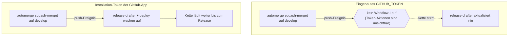

Jeder GitHub-Actions-Workflow läuft mit einem Token, das er nie angefordert hat. GitHub schiebt es als `secrets.GITHUB_TOKEN` hinein, beschränkt es auf das Repository und wirft es weg, sobald der Lauf endet.

Für die meisten Jobs ist das genau richtig — meine Lint- und Build-Pipelines nutzen nichts anderes. Wenn jemand also sieht, dass meine Merge- und Release-Workflows zusätzlich ein Token aus einer eigenen GitHub-App erzeugen, ist die berechtigte Frage: wozu der Aufwand? Das eingebaute Token ist kostenlos, automatisch und längst da.

Die kurze Antwort: Das eingebaute Token ist bewusst so gebaut, dass es blind für seine eigenen Aktionen ist. Es kann den nächsten Workflow in einer Kette nicht auslösen, und es kann nicht als eine stabile Identität über mehr als das eine Repo wirken, für das es ausgestellt wurde. Beide Grenzen sind Absicht, beide sind gute Voreinstellungen — und beide sind genau das falsche Verhalten für eine Pipeline, deren ganze Aufgabe es ist, die Arbeit an die nächste Pipeline zu übergeben. In diesem Beitrag geht es um diese Lücke und darum, warum eine GitHub-App sie schließt.

## Was das eingebaute Token wirklich ist

`GITHUB_TOKEN` ist kein Secret, das du anlegst. Zu Beginn jedes Workflow-Laufs erzeugt GitHub ein frisches Installation-Token, gibt es an den Job weiter und zieht es zurück, sobald der Lauf fertig ist. Es ist per Design kurzlebig — es liegt keine langlebige Anmeldeinformation in deinen Einstellungen, die abfließen könnte.

Seine Berechtigungen sind doppelt eingegrenzt. Sie gelten nur für das Repository, das den Workflow enthält, und sie sind durch den `permissions:`-Block gedeckelt, den der Workflow deklariert. Mein CI-Workflow verlangt das absolute Minimum:

```yaml
# .github/workflows/ci.yml — eine klassische Pipeline, mehr braucht es nicht
permissions:
  contents: read
```

Dieser Job liest den Code, prüft die Typen, baut ihn — und ist fertig. Er schreibt nie etwas, öffnet nie einen PR, muss nie einen anderen Workflow wecken. Für diese Art Arbeit ist das eingebaute Token nicht nur ausreichend — es ist die richtige Wahl, und eine App hinzuzufügen wäre reiner Ballast.

Merk dir das für später: Das Ziel ist nicht „Apps überall“. Es ist „eine App genau dort, wo das eingebaute Token nicht hinreicht“.

## Die Wand: Token-Aktionen lösen keine Workflows aus

Hier ist das Verhalten, über das jeder stolpert, direkt aus der Bauweise von GitHub Actions: **Ereignisse, die vom `GITHUB_TOKEN` ausgelöst werden, starten keinen neuen Workflow-Lauf.** Wenn ein mit dem eingebauten Token authentifizierter Job einen Commit pusht, löst dieser Push keinen `push`-Workflow aus. Wenn er ein Release veröffentlicht, löst dieses Release keinen `release`-Workflow aus.

Das ist eine bewusste Sicherung gegen Endlosschleifen. Ohne sie würde ein Workflow, der bei `push` committet, sich selbst neu auslösen, wieder pushen, wieder auslösen — endlos. GitHub durchbricht die Rekursion, indem es die Aktionen des eingebauten Tokens für das Ereignissystem unsichtbar macht. Vernünftig — genau bis zu dem Moment, in dem du tatsächlich *willst*, dass ein Workflow den nächsten weckt.

Meine Automatisierung ist eine Kette aus genau solchen Übergaben:

- Ein Pull Request verdient sich sein `automerge`-Label, und ein Workflow squash-merget ihn auf `develop`. Dieser Merge ist ein Push auf `develop` — und der Push soll `release-drafter` und den Deploy-Job wecken.
- Ein Release wird von Entwurf auf veröffentlicht umgelegt. Diese Veröffentlichung soll den Workflow wecken, der `main` auf den veröffentlichten Commit vorspult.

Führst du diese Merges und Veröffentlichungen unter dem eingebauten Token aus, stirbt die Kette an jedem Gelenk lautlos. Der Merge landet, aber der Release-Entwurf aktualisiert sich nie. Das Release wird veröffentlicht, aber `main` bewegt sich nie. Nichts schlägt fehl — der nächste Workflow läuft schlicht nie, weil für das Ereignissystem nichts mit einer echten Identität etwas getan hat.

## Was dir eine GitHub-App stattdessen gibt

Eine GitHub-App ist ein vollwertiger Akteur auf der Plattform. Du registrierst sie einmal, gibst ihr einen Satz fein abgestufter Berechtigungen und installierst sie auf den Repos, die sie brauchen. Zur Laufzeit tauscht ein Workflow die ID und den privaten Schlüssel der App gegen ein kurzlebiges Installation-Token — genauso flüchtig wie das eingebaute, aber ausgestellt unter der Identität der App statt der des Laufs.

Dieser Unterschied in der Identität ist der ganze Punkt. Weil das Token der App gehört und nicht dem `GITHUB_TOKEN`, sind die Aktionen, die es ausführt, *nicht* vom Ereignissystem ausgenommen.

Ein Push der App ist ein echter Push. Ein Release, das die App veröffentlicht, ist ein echtes Release. Der nächste Workflow in der Kette wacht genau so auf, wie er soll.

Meine Merge-Pipeline trägt deshalb beide Token und reicht die App-Anmeldedaten an den wiederverwendbaren Workflow weiter, der den eigentlichen Merge macht:

```yaml
# .github/workflows/automerge.yaml
jobs:
  automerge:
    uses: nolte/gh-plumbing/.github/workflows/reusable-automerge.yaml@v1.1.19
    with:
      app-id: ${{ vars.PORTFOLIO_APP_ID }}
    secrets:
      token: ${{ secrets.GITHUB_TOKEN }}
      app-private-key: ${{ secrets.PORTFOLIO_APP_PRIVATE_KEY }}
```

`app-id` und `app-private-key` sind die einzigen Zutaten, die du brauchst, um ein Installation-Token zu erzeugen. Der wiederverwendbare Workflow tauscht sie gegen eines, merget den PR unter der Identität der App, und der Push dieses Merges auf `develop` ist nun für `release-drafter` und den Deploy-Job sichtbar. Der Release-Publish-Workflow ist aus demselben Grund genauso verdrahtet — seine Veröffentlichung muss in den Job kaskadieren, der `main` auffrischt.

Es gibt einen zweiten, leiseren Vorteil. Das eingebaute Token spricht immer nur für das eine Repo, das es ausgestellt hat. Die App ist einmal auf Account-Ebene registriert und über das ganze Portfolio installiert, sodass die Automatisierung jedes Repos unter *derselben* Identität mit *demselben* kuratierten Berechtigungssatz läuft — an einer Stelle verwaltet, nicht pro Repo neu deklariert. Wenn eine Anmeldeinformation rotiert oder eine Berechtigung verschärft werden muss, passiert das einmal für alles statt einmal pro Repository.



## Zwei Arten von App, ein Grundbaustein

Hier lohnt sich Genauigkeit, denn „die App“ kann in meinen Repos zweierlei meinen — und beides sind unter der Haube GitHub-Apps.

Das Erste ist die App von oben: eine eigene App, deren Token meine Workflows erzeugen, um mit einer auslösenden Identität zu handeln. Sie existiert, um Arbeit die Pipeline entlangzubewegen.

Die zweite Art sind die Probot-Apps — `settings`, `boring-cyborg` und `stale`. Probot ist ein Framework, um GitHub-Apps zu bauen, die auf Ereignisse reagieren, und diese drei reagieren, um Konfiguration ehrlich zu halten. Die `settings`-App etwa gleicht meinen Branch-Schutz und meine Repo-Optionen jedes Mal aus einer eingecheckten Datei ab, wenn sich der Default-Branch bewegt:

```yaml
# .github/settings.yml — abgeglichen von der Probot-„settings"-App
_extends: nolte/gh-plumbing:.github/commons-settings.yml@v1.1.19
repository:
  default_branch: develop
  allow_squash_merge: true
  allow_merge_commit: false
```

Ich könnte im Prinzip einen klassischen Workflow schreiben, der die REST-API aufruft, um all das per Zeitplan zu erzwingen. Aber dann pflege ich wieder Token-Berechtigungen, Cron-Trigger und idempotente API-Aufrufe von Hand — und baue, schlecht, eine App nach, die es längst gibt und die genau das tut. Die Probot-Apps sind Konfiguration als Code ohne die Klempnerei, und das ist derselbe Handel wie vorher: Greif zu einer App, wenn das Modell des eingebauten Tokens nicht passt, nicht als Reflex.

## Wo klassische Pipelines bleiben

Ich will ehrlich sein: Das ist kein Urteil gegen das eingebaute Token. Die meisten meiner Workflows laufen weiter darauf — und das sollen sie auch.

CI läuft auf `contents: read` und braucht nie mehr. Der GitHub-Pages-Deploy nutzt die plattformeigene OIDC-Identität (OpenID Connect), keine App.

Auch der `release-drafter`-Job, der den Entwurf aktuell hält, läuft auf dem eingebauten Token, denn einen Entwurf zu aktualisieren muss in nichts kaskadieren — es ist ein Endpunkt, kein Gelenk in der Kette. Die App taucht an genau zwei Stellen auf: dem Merge und der Veröffentlichung, den zwei Momenten, in denen die Ausgabe eines Workflows zum Auslöser eines anderen werden muss. Überall sonst würde eine App nur einen privaten Schlüssel zum Rotieren und eine Installation zum Pflegen hinzufügen — im Tausch gegen nichts.

## Was es kostet

Auch die App ist nicht umsonst, und das Gegenteil zu behaupten wäre unehrlich.

Du registrierst und installierst sie, dann legst du ihren privaten Schlüssel als Repo- oder Organisations-Secret ab — eine langlebige Anmeldeinformation, die dir das flüchtige eingebaute Token gerade erspart hat. Dieser Schlüssel muss gehütet und irgendwann rotiert werden. Und die Indirektion ist real: Wer neu in `automerge.yaml` schaut, sieht zwei Token und einen wiederverwendbaren Workflow und muss erst das *Warum* verstehen, bevor die Verdrahtung Sinn ergibt — wofür dieser Beitrag mit da ist.

Dazu kommen Übergangskosten, solange die App noch nicht über jedes Repo ausgerollt ist. Bis die Anmeldeinformation überall verdrahtet ist, bleiben ein paar Schritte, die die App eigentlich automatisieren soll — etwa den Versions-Abgleich-Commit vor einem Release zu schreiben — manuell, und ich behalte im Auge, ob nachgelagerte Workflows nach einer Veröffentlichung tatsächlich gefeuert haben. Diese Lücke schließt sich, wenn der Rollout fertig ist, aber heute ist sie eine echte Naht.

Was ich für die Kosten bekomme, ist eine Pipeline, die sich tatsächlich wie eine Pipeline verhält: Jede Stufe übergibt an die nächste, ohne dass ich am Gelenk stehe und von Hand nachschiebe. Das eingebaute Token ist die richtige Voreinstellung für Arbeit, die dort endet, wo sie beginnt. Die App ist das, wozu du greifst, sobald die Aufgabe eines Workflows darin besteht, den nächsten zu starten.
