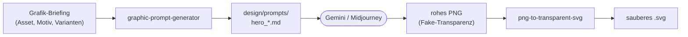

Dieser Blog weiß bereits, wie er ein Hero-Bild anzeigt. Er hat nur keines. Jeder Beitrag kann ein `heroImage` tragen, das Layout macht daraus eine Open-Graph-Karte — und bisher setzt kein einziger Beitrag das Feld. Das ist der Beitrag, in dem ich die Pipeline beschreibe, die das beheben soll — und die Voraussetzung, die mich beim ersten Lauf stoppte.

## Die Verdrahtung, die schon existiert

Das Content-Schema trägt das Feld von Anfang an. In `src/content.config.ts` deklariert die Posts-Collection es als optional:

```ts
heroImage: z.string().optional(),
```

`PostLayout.astro` reicht diesen Wert als Open-Graph-Bild an das Base-Layout weiter:

```astro
ogImage={post.data.heroImage}
```

Und `BaseLayout.astro` gibt das Meta-Tag nur aus, wenn ein Wert vorhanden ist:

```astro
{ogImage && <meta property="og:image" content={ogImage} />}
```

Der Vertrag ist also schlicht: einen Pfad in `heroImage` legen, und der Beitrag bekommt bei jedem Social-Unfurl (wenn eine Plattform die Linkvorschau abruft und rendert) eine OG-Karte. Nichts rendert das Bild, nichts erzeugt es. Dieser Teil war immer als eigene Aufgabe gedacht, und ich wollte ihn nicht jedes Mal von Hand erledigen.

## Warum zwei Agents, nicht ein Tool

Ich betreibe Claude Code mit einem geteilten Plugin über meine Repos hinweg, [`nolte/claude-shared`](https://github.com/nolte/claude-shared). Zwei seiner Agents decken die zwei Hälften von „ein Bild bekommen“ ab, die nichts miteinander zu tun haben:

- einen Prompt schreiben, der wirklich zur Marke passt, und
- das, was der Generator ausspuckt, in ein sauberes Asset verwandeln.

Sie bleiben getrennt, weil sie auf unterschiedliche Weise und zu unterschiedlichen Zeitpunkten scheitern. Das Erste ist eine Schreibaufgabe. Das Zweite ist Bildverarbeitung. Die Trennung sorgt dafür, dass jeder Schritt gegen einen frisch geladenen, engen Kontext läuft, statt dass ein Agent Marken-Tokens und Pixel-Schwellwerte gleichzeitig jongliert.



Das Prompt-Dokument in der Mitte ist der springende Punkt. Es liegt auf der Platte, unter Versionskontrolle, sodass das Bild reproduzierbar ist — ich kann es später aus demselben Prompt neu erzeugen, statt neu zu erfinden, was ich verlangt hatte.

## Agent eins: der markenkonforme Prompt

Der [`graphic-prompt-generator`](https://github.com/nolte/claude-shared/blob/027427f/agents/graphic-prompt-generator.md) nimmt ein Briefing — Asset-Typ, Motiv, Hell- oder Dunkel-Varianten, Maße und genau einen Ziel-Generator — und schreibt ein Markdown-Prompt-Dokument unter `design/prompts/`. Er ruft selbst nie einen Generator auf. Seine Ausgabe ist Text zum Einfügen in Gemini oder Midjourney.

Mehr als eine Schablone wird er durch die Reihenfolge, die er erzwingt. Jeder Prompt wird auf dieselbe Weise zusammengebaut:

1. eine kanonische Stilreferenz,
2. beschreibende Farbphrasen aus einem freigegebenen Vokabular, nie ein roher Farbton-Griff,
3. die Marken-Hex-Werte als Verstärkung angehängt,
4. ein Seed-Slot, festgehalten, selbst wenn er leer ist.

Er ergänzt außerdem eine Vermeidungs-Klausel — kein eingebetteter Text, keine Logos anderer Firmen, kein Wasserzeichen — und verlangt vom Generator ausdrücklich keine lesbare Schrift. Text-Overlay ist ein Nachbearbeitungsschritt, weil Generatoren bei Buchstaben schwach sind. Hell- und Dunkel-Varianten ziehen die Tokens des jeweiligen Modus neu, statt Farben zu invertieren — das ist der Unterschied zwischen einem echten Dark-Mode-Asset und einem ausgewaschenen.

## Die Voraussetzung, an der ich zuerst hängenblieb

Hier stoppte der erste Lauf, und das ist der ehrliche Teil dieses Beitrags. Bevor der Agent irgendetwas zusammenbaut, lädt er die Marken-Quellen des konsumierenden Repositorys: ein veröffentlichtes Design-Token-Bundle und eine `brand-vocabulary.md`, die beschreibende Phrasen mit diesen Tokens paart. Existiert keines von beiden, stoppt der Agent und meldet die fehlende Quelle. Er erfindet keine Farben.

Dieser Blog hat keine Design-Tokens und keine `brand-vocabulary.md`. Es gibt überhaupt kein `design/`-Verzeichnis. Auf diesem Repo hält Agent eins also in seiner ersten Phase an — korrekterweise.

Die Lehre kam an, bevor ein Bild kam: Die Pipeline setzt eine Marken-Ebene voraus, die diese Seite noch nicht definiert hat. Die nächste Arbeit ist nicht, Bilder zu erzeugen. Sie ist, aufzuschreiben, was „markenkonform“ hier überhaupt heißt.

## Agent zwei: die Fake-Transparenz-Falle

Der zweite Agent löst ein Problem, das ich nicht vorhergesehen hätte. KI-Bildgeneratoren liefern regelmäßig PNGs mit einem Schachbrettmuster, das *wie* Transparenz aussieht, aber direkt in die RGB-Kanäle gemalt ist, überall mit `alpha=255`. Ein Vektorisierer hält dieses Schachbrett für echten Bildinhalt und brennt es in die Ausgabe ein. Am Ende steht ein bildschirmfüllendes Schachbrett hinter dem Motiv.

[`png-to-transparent-svg`](https://github.com/nolte/claude-shared/blob/027427f/agents/png-to-transparent-svg.md) erkennt dieses Muster vor dem Vektorisieren. Er tastet die Eckpixel ab, klassifiziert den Hintergrund als graues Schachbrett oder einfarbige Fläche, schreibt die qualifizierenden Pixel auf `alpha=0` um und schickt erst dann das gesäuberte PNG durch [vtracer](https://github.com/visioncortex/vtracer). Danach entfernt er jeden bildschirmfüllenden Hintergrund-Pfad, den der Vektorisierer noch ausgibt.

Er meldet pro Datei eine Diagnose, bevor er irgendetwas anfasst. Außerdem hat er eine Plausibilitätsprüfung, die das Klauen wert ist: Ein typisches Icon ist zu 70 bis 90 Prozent Hintergrund, wenn also weniger als 30 Prozent der Pixel entfernt werden, ist das ein Warnsignal, das er meldet, statt weiterzumachen. Zudem überschreibt er nie die Eingabe — das gesäuberte PNG ist eine neue Datei.

## Wo das den Blog zurücklässt

Die Pipeline ist solide und die Agents sind real. Was fehlt, liegt vor beiden: Dieser Blog braucht eine Marken-Definition, bevor Agent eins läuft, und erst dann hat Agent zwei etwas zu säubern. Der nächste Commit hier ist also kein Hero-Bild. Es ist ein `design/`-Verzeichnis mit Tokens und einem Farbvokabular — das, wonach der Prompt-Generator fragte und es nicht fand.

Mir ist diese Reihenfolge lieber, als eine Marke in einen einzelnen Wegwerf-Prompt hineinzufälschen. Der ganze Grund für das Design „Prompt-Dokument auf der Platte“ ist Konsistenz über jedes künftige Bild hinweg — und Konsistenz bekommt man nicht, indem man die Palette einmal errät.
