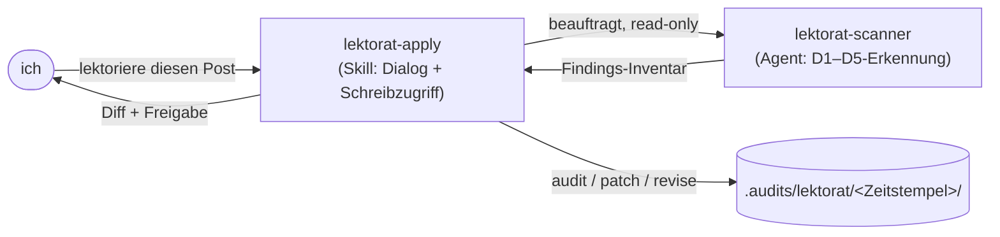

Jeder Beitrag auf dieser Seite ist KI-entworfen und danach von Hand kuratiert. Dem Entwerfen vertraue ich; das Kuratieren will ich nicht per Augenmaß erledigen — jeden Absatz auf Satzlänge, undefinierten Jargon und Register-Drift abzuklopfen ist genau die Arbeit, bei der ich schlecht konsistent bin. Also habe ich sie an ein Werkzeug abgegeben: `Lektorat`, die Redaktionsschicht in meinem geteilten Claude-Code-Plugin [`nolte-shared`](https://github.com/nolte/claude-shared). Es liest einen Beitrag, bevor ich ihn veröffentliche.

Wer das Plugin noch nicht kennt: Der [Baseline-Beitrag](/de/blog/claude-shared-baseline) erklärt, warum ein einziges geteiltes Plugin in jedem Repo sitzt. Hier geht es um eine Fähigkeit darin: den Redakteur.

## Was ein Redakteur tatsächlich prüfen muss

Der schwierige Teil am Redigieren ist nicht, einen Tippfehler zu korrigieren. Es ist, mehrere voneinander unabhängige Prüfungen gleichzeitig im Kopf zu halten und sie gleichmäßig über ein ganzes Dokument anzuwenden. Lektorat benennt diese Prüfungen als fünf Dimensionen, definiert im Spec unter `spec/project/lektorat/`:

- **D1 — Lesbarkeit.** Haben Sätze und Absätze die richtige Länge für den Zweck der Seite?
- **D2 — Verständlichkeit.** Gibt es Jargon, ein nicht ausgeschriebenes Akronym oder eine versteckte Voraussetzung, die der Leser nicht auflösen kann?
- **D3 — Rechtschreibung und Grammatik.** Die mechanische Ebene.
- **D4 — Stil.** Aktiv statt Passiv, konsistente Zeitform, Überschriften in Satzschreibung, kein Register, das mittendrin kippt.
- **D5 — Audience-Fit.** Passt die Seite zu der Zielgruppe, die sie zu bedienen vorgibt?

Jeder Befund hat eine von drei Severities: `critical`, `warning` oder `suggestion`. Diese Reihenfolge macht den Report handhabbar — ich behebe die kritischen, ich lese die Warnungen, und ich behandle die Vorschläge als optional.

Die Dimensionen sind nicht alle handgestrickte Heuristiken. D1 stützt sich auf **LIX**, eine Lesbarkeitsmetrik, die für Englisch und Deutsch gleich berechnet wird, mit einem Zielkorridor, der vom Seitentyp abhängt. D3 und D4 kommen für Englisch von [Vale](https://vale.sh); die deutsche Seite nutzt standardmäßig einen LanguageTool-HTTP-Endpunkt. Lektorat verwendet diese Werkzeuge — es baut sie nicht nach.

## Drei Arten, es zu betreiben: audit, patch, revise

Dieselbe Fünf-Dimensionen-Prüfung treibt drei Operationen an, und die richtige zu wählen ist der größte Teil davon, das Werkzeug gut zu benutzen.

`audit` ist read-only. Es scannt das Ziel, schreibt einen Report und fasst nichts anderes an. Es lässt sich gefahrlos unbeaufsichtigt laufen — in einem Pre-Commit-Hook, als Release-Gate oder einfach, weil ich wissen will, wie groß ein Rückstand ist.

`patch` ist der interaktive Korrektor: ein Befund, ein Diff, eine Freigabe. Es geht die Befunde in Severity-Reihenfolge durch und zeigt mir für jeden ein Unified-Diff (ein Patch-Format, das die geänderten Zeilen mit umgebendem Kontext zeigt). Ich gebe `approve`, `skip` oder `skip-and-record` — Letzteres schreibt eine dauerhafte Verwerfung, sodass der Befund nie wieder auftaucht. Es bündelt nie zwei Korrekturen in einer Bearbeitung.

`revise` ist die schwere Variante: ein vollständiges Umschreiben des Artefakts, das jeden `critical`- und `warning`-Befund in einem Durchgang adressiert, mir als ein einziger Diff zur Annahme oder Ablehnung gezeigt. Die Regel ist streng — es darf umformulieren, muss aber jeden Fakt, jede Aussage, jeden Befehl, jedes Linkziel und jeden Codeblock aus dem Original behalten. Es ist ihm verboten, neuen Inhalt zu erfinden, um einen Satz abzurunden.

## Die Trennung: ein Skill, der spricht, ein Agent, der liest

Lektorat besteht aus zwei Teilen, und die Grenze zwischen ihnen ist Absicht. `lektorat-apply` ist ein Skill — er spricht mit mir, führt die Freigabe-Dialoge und besitzt jeden Schreibzugriff auf die Festplatte. `lektorat-scanner` ist ein Agent, den er für den Erkennungsdurchlauf beauftragt, und dieser Agent ist von Bauart read-only: seine Werkzeugliste ist `Read`, `Grep`, `Glob`, `Bash`, ganz ohne `Edit` oder `Write`.

Der Grund für die Trennung: „ein Redakteur, der still umschreiben kann, was er findet“ ist die falsche Form. Indem die Erkennung in einen werkzeugbeschränkten Agent wandert, wird das read-only-Versprechen von `audit` von der Runtime erzwungen, nicht nur durch guten Willen. Der Agent kann nicht schreiben, selbst wenn er wollte. Der Skill bleibt im Gespräch, um Diffs zu zeigen und auf mein `approve` zu warten.

## So setze ich es bei diesem Beitrag ein

Hier ist die tatsächliche Schleife. Ich frage in normaler Sprache danach — der Skill löst bei Phrasen wie „lektoriere diesen Post“ oder „prüfe die Docs auf Lesbarkeit“ aus, auf Deutsch oder Englisch. Er löst auf, welche Sprachregeln pro Datei gelten (deutsche Regeln auf der deutschen Datei, englische auf der englischen), liest das Audience-Artefakt, um zu wissen, wen die Seite bedient, und beauftragt dann den Scanner.

Was auf der Festplatte landet, ist eine Audit-Spur unter `.audits/lektorat/<YYYY-MM-DD-HHMM>/`. Die zwei Dateien, die ich öffne, sind `findings.json` (maschinenlesbar, stabil über Läufe hinweg) und `summary.md` (nach Severity sortiert, menschenlesbar). Eine `run.json` hält fest, worum ich gebeten habe. Laufe ich `patch`, sammeln sich Verwerfungen in `dismissals.json`; laufe ich `revise`, liegen die Reports vor und nach dem Umschreiben neben einem `rewrite.diff`.

Dieser Beitrag ist zweisprachig, also deckt das Audit beide Dateien als ein Paar ab. Der englische Text bekommt eine LIX-Messung und einen Vale-Durchlauf; die deutsche Übersetzung bekommt ihre eigene LIX-Messung und die deutsche Grammatik-Pipeline. Ein falsch geschriebenes deutsches Wort ist ein deutscher Befund auf der deutschen Datei — Lektorat versucht nie, einen deutschen Satz zu „reparieren“, indem es ihn englisch macht, und umgekehrt. So eine sprachübergreifende Passage wird mir zur Entscheidung vorgelegt, nicht still umgeschrieben.

Der ehrliche Teil: Genau dieser Beitrag ist durch diese Schleife gelaufen, bevor er veröffentlicht wurde. Der Autoren-Skill übergibt das fertige Paar als letzten Schritt an `lektorat-apply`, ich habe die Zusammenfassung gelesen, die kritischen Befunde behoben und die Warnungen, mit denen ich nicht einverstanden war, verworfen — protokolliert, in der Handover-Datei, die im selben Commit mitfährt.

## Was es ablehnt zu tun

Die Leitplanken sind, wo ich Vertrauen gewonnen habe. Lektorat lektoriert nichts unter `spec/`, fasst weder die `SKILL.md` eines Skills noch die Definition eines Agents an und bearbeitet weder Quellcode noch generierte Konfiguration noch Lockfiles. Sein Geltungsbereich ist Markdown-Prosa, Punkt.

Während `audit` schreibt es nichts außerhalb des Audit-Spur-Ordners. Bei jeder Korrektur bewahrt es die strukturellen Invarianten — Codeblöcke, Linkziele, Schlüsselreihenfolge im Frontmatter sowie Anzahl und Reihenfolge von Listeneinträgen bleiben byte-identisch, sofern ein Befund sie nicht ausdrücklich zum Ziel hat.

Es kann auch keinen fehlenden Fakt überdecken. `revise` ist es untersagt, einen Befehl, einen Pfad, einen Produktnamen oder eine URL hinzuzufügen, die nicht im Original stand — braucht die Prosa eine, hält es an und fragt, statt zu erfinden. Und es committet, pusht und öffnet nie einen Pull Request; die Korrekturen landen in meinem Arbeitsbaum, der Rest ist meine Entscheidung.

## Warum ich ihm hier mehr vertraue als mir selbst

Ein menschlicher Redakteur — ich, um 23 Uhr — ist inkonsistent. Ich fange einen langen Satz auf Seite eins ab und winke einen identischen auf Seite drei durch. Lektorat nicht. Es legt denselben Korridor an jeden Absatz, hält jeden Befund mit einer stabilen ID fest, sodass eine Verwerfung von letzter Woche auch diese Woche noch gilt, und hinterlässt eine Audit-Spur in git, die genau sagt, was es geprüft und was ich entschieden habe.

Es ist kein Ersatz dafür, die eigene Arbeit zu lesen — es hat nichts dazu zu sagen, ob ein Argument etwas taugt. Was es mir gibt, ist ein Konsistenz-Fundament: Die mechanischen, die Audience- und die Lesbarkeitsprüfungen laufen jedes Mal gleich ab, sodass das Urteil, das ich einbringe, für den Teil bleibt, der wirklich einen Menschen braucht. Dieser Tausch ist der ganze Grund, warum der Redakteur ein Werkzeug ist und keine lästige Pflicht.
