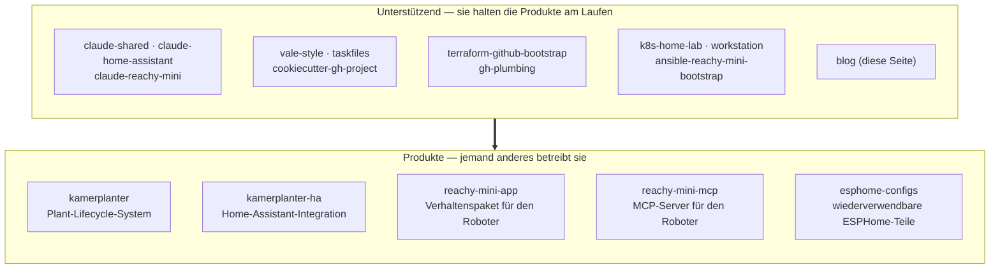

Wer mein GitHub-Profil öffnet und nach „zuletzt gepusht" sortiert, bekommt eine Liste, die zerstreut wirkt: ein Pflanzenpflege-System, ein Kubernetes-Home-Lab, drei Claude-Code-Plugins, ein Terraform-Bootstrap für die Organisation selbst, ein Verhaltenspaket für einen Roboter. Der Snapshot weiter unten ist die aktive Menge ohne Forks und ohne Archive, Stand 2026-05-30. Die Zerstreuung ist echt, aber sie löst sich sauber auf, sobald man jedem Repo eine Frage stellt: Für wen ist es eigentlich?

Diese Frage teilt das Portfolio in zwei Stapel. Der eine Stapel ist Software, die jemand außer mir installieren und betreiben soll. Der andere Stapel existiert, damit der erste Stapel ausgeliefert werden und laufen kann. Der zweite Stapel ist deutlich größer — und dieses Verhältnis ist das Ehrlichste, was das Profil über meine Arbeitsweise sagt.

## Der Test, den ich an jedes Repo anlege

Die Trennung ist nicht „Bibliothek gegen Anwendung" und auch nicht „groß gegen klein". Es geht um den Leser am anderen Ende.

Ein Repo ist ein **Produkt**, wenn sein Erfolg daran gemessen wird, dass jemand anderes es benutzt: ein Home-Assistant-Nutzer, der meine Integration hinzufügt, ein Roboter-Besitzer, der ein Verhalten installiert, ein Model-Context-Protocol-Client (MCP), der mit meinem Server spricht. Ein Repo ist **unterstützend**, wenn sein Erfolg daran gemessen wird, dass meine eigene Arbeit schneller, sicherer oder konsistenter wird — eine geteilte Claude-Code-Basis, eine Terraform-Definition der GitHub-Organisation, ein Provisioning-Playbook.

Die Grenze verschwimmt gelegentlich — ein paar unterstützende Repos sind öffentlich und wiederverwendbar, also *könnte* sie eine fremde Person übernehmen —, aber der Test hält an der Absicht fest. Ich pflege `taskfiles`, damit meine eigenen Builds konsistent bleiben; wenn du es ebenfalls einbindest, ist das ein willkommener Nebeneffekt, nicht der Grund, warum es existiert.

## Die Produkte: gebaut, damit jemand anderes sie betreibt

Hier gibt es zwei Produktlinien, plus einen Ausreißer. Jede benennt einen Leser, den ich mir vorstellen kann.

**`kamerplanter`** ist ein Plant-Lifecycle-System — die Repo-Beschreibung nennt es „agricultural technology system for plant lifecycle management", und die Topics listen FastAPI, React, Helm und Kubernetes. Dieser Stack verrät den gemeinten Leser: jemand, der einen echten Dienst will, um Pflanzen über die Zeit zu verfolgen, kein Skript. **`kamerplanter-ha`** ist dieselbe Produktlinie, die die Leute dort abholt, wo sie ohnehin schon sind. Es ist eine Home-Assistant-Integration, installierbar über HACS (den Home Assistant Community Store), also ist sein Leser enger und konkreter: ein Home-Assistant-Nutzer, der schon ein Dashboard betreibt und die Pflanzendaten darin haben will statt in einer separaten App.

Die Reachy-Mini-Linie richtet sich an Besitzer des Reachy-Mini-Roboters. **`reachy-mini-app`** ist ein Verhaltenspaket auf Basis des `reachy_mini`-SDK von Pollen Robotics / Hugging Face — der Leser ist ein Roboter-Besitzer, der will, dass der Roboter *etwas tut*. **`reachy-mini-mcp`** ist ein MCP-Server, der den Pollen-Daemon in REST (HTTP/JSON) verpackt. Sein Leser ist eine Stufe technischer: jemand, der den Roboter an einen MCP-Client oder eine Automatisierung anbindet und eine API-Oberfläche braucht statt eines fertig geschnürten Verhaltens.

Der Ausreißer ist **`esphome-configs`**, beschrieben als „small reusable parts for works with esphome" und mit `iot` und `smart-home` getaggt. Sein Leser ist ein Smart-Home-Bastler, der schon ESPHome-YAML schreibt und Bausteine will statt fertiger Firmware. Es liegt am nächsten am unterstützenden Stapel — es sind Teile, kein Produkt —, aber die Teile sind *für andere Bastler* veröffentlicht, also zähle ich es als Produkt.

Fünf Repos. Das ist die gesamte nach außen gerichtete Fläche, und zwei davon sind dasselbe Pflanzensystem mit zwei Gesichtern.

## Das unterstützende Ensemble: gebaut, damit die Produkte ausgeliefert werden

Alles Übrige ist Unterbau. Es gruppiert sich in vier Aufgaben.

**Festschreiben, wie ich mit Claude Code arbeite.** `claude-shared` ist die Repo-übergreifende Basis — ich habe darüber geschrieben, [warum es ein Plugin ist](/de/blog/claude-shared-baseline) und nicht ein Dutzend auseinanderdriftender `CLAUDE.md`-Kopien. `claude-home-assistant` und `claude-reachy-mini` erweitern diese Basis um Domänen-Skills: das erste für Custom Integrations, Lovelace-Karten und Blueprints; das zweite für die Dance-to-Music-Verhaltensweisen des Roboters und seine Home-Assistant-Anbindung. Ihr Leser ist ich-mit-Claude und damit auch jeder Entwickler, der dieselben Plugins installiert.

**Doku, Builds und neue Repos konsistent halten.** `vale-style` ist ein geteiltes Vale-Vokabular, `taskfiles` ist ein Satz wiederverwendbarer `Taskfile`-Includes, und `cookiecutter-gh-project` ist die Vorlage, die ein neues Repo mit bereits verdrahteten Workflows ausstanzt. Diese drei existieren, damit der Start von Projekt Nummer zwanzig so wenig kostet wie der von Projekt Nummer zwei.

**Die GitHub-Organisation als Code behandeln.** `terraform-github-bootstrap` definiert die Einstellungen, Teams und Branch-Protection-Regeln der Organisation in Terraform; `gh-plumbing` trägt die projektbezogene Verrohrung obendrauf. Der Leser ist, wer die `nolte`-Organisation administriert — heute bin das ich, aber der Sinn des Aufschreibens ist, dass es nicht mehr nur in meinem Kopf liegt.

**Die Infrastruktur darunter betreiben.** `k8s-home-lab` ist das Kubernetes-Home-Lab — Kind oder Talos, verwaltet mit ArgoCD und Argo Workflows —, auf das der Pflanzendienst tatsächlich deployen kann. `ansible-reachy-mini-bootstrap` provisioniert den Raspberry Pi des Roboters über WLAN. `workstation` konfiguriert meine eigene Entwicklungsmaschine. Und dieser `blog` ist das Schaufenster: das eine unterstützende Repo, dessen Ergebnis gelesen statt betrieben werden soll.

## Was das Verhältnis tatsächlich aussagt

Fünf Produkte gegen rund vierzehn unterstützende Repos ist kein Zufall, und für einen technischen Leser ist genau das der interessante Teil.

Jedes Produkt sitzt auf einem Stapel von Repos, die nie einem Nutzer begegnen. Die Reachy-Mini-Linie ist das klarste Beispiel: Die App und der MCP-Server sind die sichtbare Spitze, aber `ansible-reachy-mini-bootstrap` provisioniert die Hardware und `claude-reachy-mini` ist überhaupt erst die Art, wie ich die Verhaltensweisen baue. Nimmt man die unterstützenden Repos weg, werden die Produkte nicht kleiner — sie hören auf, ausgeliefert zu werden. Die Pflanzenintegration braucht das Home-Lab als Unterbau; die Roboter-Verhaltensweisen brauchen den provisionierten Pi und die Claude-Skills, um sie zu schreiben.

Früher habe ich diese Schicht implizit gelassen, verstreut über lokale Skripte und eine persönliche `CLAUDE.md`. Sie explizit zu machen — jedes Teil als eigenes Repo, mit eigener README und eigenem Leser — ist das, was die Produkt-Repos klein und lesbar hält. Der Unterbau trägt das Gewicht, damit die Produkte es nicht tragen müssen.

Wenn du das Profil also überfliegst, um zu beurteilen, was ich baue: Lies die fünf Produkte für das *Was* ich ausliefere, und lies die vierzehn unterstützenden Repos für das *Wie* ich es weiter ausliefere. Die zweite Liste ist die längere Antwort und meistens die ehrlichere.
