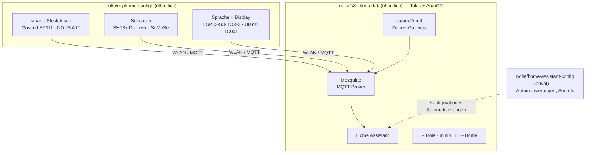

Die Lampen, Steckdosen und Sensoren in meiner Wohnung gehorchen keiner Hersteller-Cloud. Wenn eine smarte Steckdose abschaltet, weil ein Wasserleck-Sensor ausgelöst hat, fällt diese Entscheidung auf Hardware, die mir gehört, in Software, die ich lesen kann — und nichts verlässt dafür das Gebäude.

Leute hören „Smart Home“ und stellen sich eine App und ein Konto vor. Meins ist ein Stapel aus Git-Repositories.

Es sind drei, und sie teilen sich entlang einer Linie, die sich als die eigentliche Geschichte herausstellt: zwei sind öffentlich, eins ist privat. In diesem Beitrag geht es darum, was jedes Repo tut — und da ich zwei davon bewusst der Welt geöffnet habe, warum das Öffentlich-Sein der erzählenswerte Teil ist.

## Drei Ebenen, drei Repos

Ein selbst gehostetes Smart Home ist kein einzelnes Projekt. Es sind mindestens drei, gestapelt:

- **Die Geräte** — die Firmware auf jeder Steckdose, jedem Sensor, jedem Display. Das ist [`nolte/esphome-configs`](https://github.com/nolte/esphome-configs), und es ist **öffentlich**.
- **Die Plattform** — das Cluster, das die Dienste hostet, mit denen die Geräte sprechen. Das ist [`nolte/k8s-home-lab`](https://github.com/nolte/k8s-home-lab), und es ist **öffentlich**.
- **Das Gehirn** — die persönlichen Automatisierungen, der Grundriss meiner tatsächlichen Wohnung, die Secrets. Das ist `nolte/home-assistant-config`, und es ist **privat**.



Die Pfeile zeigen nur nach innen, hin zu Diensten, die ich selbst betreibe. Genau das bedeutet „cloud-less“ hier in der Praxis: Die Aufgabe eines Geräts ist es, einen Broker auf meinem eigenen Cluster zu erreichen, nicht einen Endpunkt auf dem von jemand anderem.

## esphome-configs: die Geräte, einmal definiert

[ESPHome](https://esphome.io/) macht aus billigen ESP8266- und ESP32-Boards Home-Assistant-Geräte, indem es eine YAML-Beschreibung zu Firmware kompiliert. Der naive Weg, ein Dutzend davon zu betreiben, ist, pro Gerät eine vollständige Konfiguration zu kopieren und die Unterschiede zu editieren. Das fault schnell.

`esphome-configs` ist andersherum gebaut. Jede Datei unter `src/*.yaml` ist ein physisches Gerät, und sie bleibt winzig, weil sie geteilte Bausteine aus `src/common/` über ESPHomes `packages:`-Include-Mechanismus zusammensetzt.

WLAN, die API-Verbindung, Over-the-Air-Updates und Diagnose-Sensoren sind einmal in einem Basis-Paket definiert; ein Hardware-Profil wie `common/gosund-sp111.yaml` ergänzt Relais, Taster und Energiechip. Eine neue Steckdose sind ungefähr zehn Zeilen, nicht hundert:

```yaml
# src/gosund-sp111-02.yaml — ein Gerät
substitutions:
  name: gosund-sp111-02
  comment: "Washing machine plug"

packages:
  plug: !include
    file: common/gosund-sp111.yaml        # Hardware-Profil
  kill: !include
    file: common/switch-kill-sensor.yaml  # wiederverwendbares Verhalten
    vars:
      kill_sensor_entity: binary_sensor.water_leak
```

Das Repo trägt echte, vielfältige Hardware: die Steckdosen Gosund SP111 und NOUS A1T, ESP32-Kameras, die ESP32-S3-BOX-3 und Ulanzi TC001 für Sprache und Display, sowie Sensoren von einem schlichten SHT3x-D-Temperaturchip bis zu einer mehrpunktigen Füllstandssonde. Es gibt sogar eine eigene External Component, `somose`, mit eigenem C++ unter `src/my_components/` — die Notausstiegsluke für den Fall, dass YAML allein nicht mit einem Sensor reden kann.

Ein Detail zählt mehr, als es aussieht: Keine Anmeldedaten liegen im Repo. WLAN- und MQTT-Secrets werden aus [`pass`](https://www.passwordstore.org/) zur Kompilierzeit als Umgebungsvariablen eingespeist, und ESPHome selbst läuft über ein Docker-Image, sodass es keine lokale Toolchain gibt, die wegdriften kann. Du flashst ein Gerät einmal über Serial, danach geht jedes Update über die Luft.

## k8s-home-lab: die Plattform unter dem Gehirn

Die Geräte brauchen etwas, mit dem sie reden. Dieses Etwas ist ein Kubernetes-Cluster, der vollständig in `k8s-home-lab` beschrieben ist.

Es ist ein GitOps-Aufbau, das heißt der gesamte Soll-Zustand des Clusters liegt als Manifeste in Git: [ArgoCD](https://argo-cd.readthedocs.io/en/stable/) gleicht die Kubernetes-Manifeste aus dem Repository auf das Cluster ab, und [Argo Workflow](https://argoproj.github.io/argo-workflows/) übernimmt obendrauf die Prozessautomatisierung. Das Cluster selbst läuft auf [Talos](https://www.talos.dev/) für das eigentliche Home Lab, mit einer [Kind](https://kind.sigs.k8s.io/)-Variante für Wegwerf-Entwicklung. Das Repo bündelt Dienste in „Service-Sets“ für verschiedene Aufgaben — ein Entwickler-Set, Speicher, und das hier entscheidende: Smart Home.

Das Smart-Home-Service-Set ist das selbst gehostete Backend, das dir ein Cloud-Produkt sonst verkaufen würde:

- **Mosquitto** — der MQTT-Broker, auf den jedes ESPHome-Gerät publiziert.
- **zigbee2mqtt** — ein selbst gebautes Zigbee-Gateway, damit Zigbee-Geräte auf demselben MQTT-Bus landen.
- **Home Assistant** — der zentrale Ort, an dem Geräte und Automatisierungen zusammenkommen.
- **ESPHome** — ja, läuft auch im Cluster, zum Verwalten genau der Geräte, die das andere Repo definiert.
- **PiHole** und **minio** — Werbe-/Tracker-Blocken auf DNS-Ebene (Domain Name System) und Langzeitspeicher.

Zusammengenommen ist das ein vollständiger Smart-Home-Stack ohne Konto zum Anmelden und ohne ein Upstream, das ihn abkündigen kann. Dasselbe Repo, das mein Zuhause betreibt, lässt sich abreißen und aus Git neu aufbauen, denn das Cluster ist eine Beschreibung, kein Schoßtier.

## home-assistant-config: der Teil, der privat bleibt

Das dritte Repo ist das, das ich geschlossen halte — und zwar mit Absicht.

`home-assistant-config` ist die persönliche Konfiguration: die Automatisierungen, die meine Routinen kennen, die Namen meiner Räume, die Anwesenheitslogik, die Secrets. Nichts davon ist wiederverwendbar, alles davon ist spezifisch für ein Zuhause — meins. Es zu veröffentlichen würde einen Grundriss und einen Tagesablauf preisgeben, ohne dass jemand etwas davon hätte.

Also bleibt es privat, und das ist keine Lücke im ansonsten offenen Aufbau. Es ist der Entwurf.

## Warum öffentlich die interessante Entscheidung ist

Die ersten beiden Repos öffentlich zu machen war keine Voreinstellung — privat ist die sicherere Voreinstellung. Die Gründe, warum es sich auszahlt, sind der eigentliche Punkt dieses Beitrags.

**Die öffentlichen Repos sind die wiederverwendbaren.** Eine DRY-Sammlung (Don't Repeat Yourself) von ESPHome-Paketen und ein in Code beschriebenes GitOps-Cluster sind genau die Dinge, die jemand anderes übernehmen, anpassen und von denen er lernen kann. Das private Repo ist das, das niemand sonst gebrauchen könnte. Die Grenze öffentlich/privat ist die Grenze wiederverwendbar/persönlich, ehrlich gezogen.

**Öffentlich-als-Standard erzwingt Secrets-Hygiene.** Wenn ein Repo offen ist, hört „keine Anmeldedaten einchecken“ auf, ein Nice-to-have zu sein. Deshalb kommen ESPHome-Secrets zur Kompilierzeit aus `pass`, und deshalb trägt nichts im Cluster-Repo ein Passwort fest ein — die Disziplin wird vom Publikum erzwungen, und der Aufbau ist dadurch sicherer.

**Offenheit schlägt einen Screenshot.** „Ich hoste mein Smart Home selbst“ ist eine Behauptung. Ein Repo, in dem du lesen kannst, wie eine Gosund-Steckdose ein Basis-Paket zusammensetzt oder wie ein Service-Set Mosquitto mit zigbee2mqtt verdrahtet, ist der Beleg. Für jeden, der entscheidet, ob der Ansatz das Wochenende wert ist, beantwortet funktionierendes YAML Fragen, die ein Blogbeitrag nicht kann.

## Was es ehrlich kostet

Das ist mehr Arbeit als ein Hub und eine App, und ich tue nicht so, als wäre es anders. ESPHome heißt, sich um Firmware und das gelegentliche Serial-Kabel zu kümmern. Ein Cluster aus Talos plus ArgoCD ist ein echtes Stück Arbeit — GitOps zahlt sich über Jahre aus, nicht am ersten Tag, und das erste Bootstrap ist der schwerste Teil.

Wenn du heute Abend einfach nur per Handy eine Lampe einschalten willst, kauf dir die Bridge.

Was du dir mit dem Aufwand erkaufst, ist Eigentum. Die Geräte funktionieren weiter, wenn ein Upstream-Dienst abgeschaltet wird — weil es gar keinen Upstream gibt, von dem sie abhängen. Das ganze System ist lesbar, lässt sich umbauen und aus Git neu aufbauen.

Und die zwei Repos, die die wiederverwendbare Hälfte davon enthalten, liegen offen da — nicht, weil alles öffentlich sein sollte, sondern weil die Teile, die jemand anderem helfen, keinen Grund haben, versteckt zu sein.
