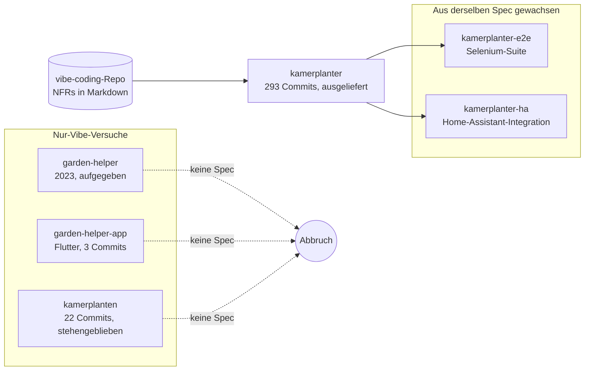

Ich habe dieselbe App dreimal angefangen, bevor sie blieb. Die Version, die ausgeliefert wurde, ist [`kamerplanter`](https://github.com/nolte/kamerplanter), ein selbstgehostetes System zur Pflanzenverwaltung mit inzwischen über 293 Commits. Es ist der erste Anlauf, für den ich eine Spezifikation geschrieben habe, bevor ich Code geschrieben habe. In diesem Beitrag geht es um genau diesen einen Unterschied — denn er war am Ende das ganze Experiment.

„Vibe Coding" meint normalerweise das Gegenteil: Du beschreibst eine Stimmung, das Modell schreibt Code, du schubst es an, bis etwas läuft. Davon habe ich reichlich gemacht. Das ehrliche Ergebnis war ein Friedhof halbfertiger Repos. Was sich änderte, war nicht das Modell und nicht mein Prompting — es war eine geschriebene Spec vor dem Vibe.

## Der Friedhof der Fehlstarts

Die Idee ist alt. Schon 2023 hatte ich `garden-helper`, ein kleines Python-Werkzeug, dessen README noch immer „Database for manage our flowers and vegetables" liest. Daneben lag `garden-helper-app`, ein Flutter-Client, der nie über drei Commits und eine „work in progress"-Notiz hinauskam. Beide sind seit Jahren tot.

Die Idee der Pflanzenverwaltung kam Ende 2025 und Anfang 2026 zurück. Ich habe sie noch zweimal aufgesetzt — einmal als „SmartPlant"-Beispielprojekt, einmal als `kamerplanten`, ein Gerüst aus FastAPI und ArangoDB. Das zweite kam auf 22 Commits und blieb dann stehen. Keines davon hatte einen Claude-Co-Autor, und keines hatte eine Spec.

Sie scheiterten alle auf dieselbe Weise. Ich startete aus einer Stimmung heraus, erzeugte plausible Struktur und blieb genau in dem Moment hängen, in dem eine echte Entscheidung anstand. Welche Datenbank? Wie sehen Fehler auf der Leitung aus? Was bedeutet „Wachstumsphase" überhaupt als Datum?

Ohne schriftliche Antwort verhandelte jede Sitzung die letzte neu. Der Code driftete, weil die Absicht nie festgenagelt wurde.

## Was sich änderte: Ich schrieb es zuerst auf

Beim nächsten Mal öffnete ich keinen Editor. Ich öffnete Obsidian und begann ein eigenes Repo namens [`vibe-coding`](https://github.com/nolte/vibe-coding), dessen einzige Aufgabe es war, Spezifikationen zu halten. Dort liegt kein Anwendungscode — nur Markdown.

Ich schrieb die Anforderungen in einer Rolle. Das Autorenfeld auf jedem Dokument sagt „Business Analyst - Agrotech", weil das die Rolle war, die ich beim Schreiben spielte. Jede nichtfunktionale Anforderung (NFR) beginnt mit User Stories aus benannten Rollen, dann ein Business Case, dann Akzeptanzkriterien.

NFR-006 trägt zum Beispiel den Titel „Strukturierte API-Fehlerbehandlung mit eindeutiger Tracking-ID" und liest sich so:

```markdown
**Als** Frontend-Entwickler
**möchte ich** bei jedem API-Fehler eine eindeutige Tracking-ID
  und eine verständliche Fehlerbeschreibung erhalten
**um** Fehler schnell an das Backend-Team eskalieren zu können.
```

Das fühlte sich langsam und ein bisschen albern an. Für ein Hobbyprojekt allein User Stories zu schreiben, ist nicht der naheliegende Schritt. Aber es zwang mich, die Entscheidungen zu beantworten, die die früheren Anläufe getötet hatten — in Prosa, einmal, bevor irgendein Code von ihnen abhing.

## Von einem Spec-Absatz zur Python-Datei

Hier kommt der Teil, der mich überzeugt hat. NFR-006 blieb nicht bei „Fehler sollten strukturiert sein" stehen. Es enthielt das tatsächliche Pydantic-Schema, das ich wollte, samt Beschreibungen:

```python
class ErrorResponse(BaseModel):
    error_id: str = Field(
        description="Eindeutige ID zur Nachverfolgung (Format: err_<uuid4>)"
    )
    error_code: str = Field(
        description="Maschinenlesbarer Fehlercode (z.B. VALIDATION_ERROR)"
    )
    message: str = Field(description="Menschenlesbare Fehlerbeschreibung")
    details: list[ErrorDetail] = Field(default_factory=list)
    timestamp: datetime
    path: str
    method: str
```

Als ich Claude dann auf die Spec zeigte und um die Umsetzung bat, ist die Datei, die es schrieb — `app/common/error_schemas.py` im `kamerplanter`-Repo — fast dasselbe Objekt:

```python
class ErrorResponse(BaseModel):
    error_id: str = Field(description="Unique tracking ID (format: err_<uuid4>)")
    error_code: str = Field(description="Machine-readable error code")
    message: str = Field(description="Human-readable error description")
    details: list[ErrorDetail] = Field(default_factory=list)
    timestamp: datetime
    path: str
    method: str
```

Beachte die eine echte Änderung: Die Beschreibungen sind jetzt englisch. Das war kein Versehen. Eine andere Anforderung, NFR-003, schreibt einen englischen Source-Code-Standard vor, also erzeugte die deutsche Spec mit Absicht englischen Code. Zwei Dokumente, Tage auseinander geschrieben, lösten einen Konflikt zwischen sich selbst — ohne dass ich ihn im Moment entscheiden musste. Die Spec erledigte das Denken, das ich früher jede Sitzung neu machte.

## Warum die Spec die KI nützlich machte

Ein Modell ist nur so gut wie der Kontext, aus dem es arbeitet. Meine früheren Prototypen gaben Claude eine Stimmung und ein leeres Repo, also füllte es die Lücken mit plausiblen Vermutungen — und plausible Vermutungen sind sich über Sitzungen hinweg nicht einig. Die Spec ersetzte das Raten durch eine feste Referenz, auf die wir beide zeigen konnten.

Diese Stabilität ist der Grund, warum das Projekt tatsächlich wachsen konnte. Die `kamerplanter`-Commits sind mit Claude Opus 4.6 und 4.7 co-autorisiert, und es sind 293 statt 22.

Die Spec zog außerdem um: Sie lebt nicht mehr nur im `vibe-coding`-Inkubator. Das Projekt trägt jetzt einen eigenen `spec/`-Baum, mit getrennten Ordnern für Anforderungen, NFRs, Architekturentscheidungen, Design und End-to-End-Testfälle. Die Spezifikation wuchs neben dem Code heran, statt nach dem ersten Sprint weggeworfen zu werden.



Derselbe Ansatz trug bis in die Satelliten. Die End-to-End-Tests in `kamerplanter-e2e` und die [`kamerplanter-ha`](https://github.com/nolte/kamerplanter-ha)-Integration für Home Assistant begannen beide mit geschriebenen Specs, und beide sind auf dieselbe Weise co-autorisiert. Sobald das Muster einmal funktionierte, war es umsonst, es wiederzuverwenden.

## Was es gekostet hat

Ich will das nicht reibungslos verkaufen, denn das war es nicht.

Specs vorab zu schreiben, ist echte Arbeit, und ein Teil davon war verschwendet. Ein paar NFRs waren für eine Hobby-App mit einem Nutzer überdimensioniert — die Ambitionen für Kubernetes und mehrere Datenbanken lesen sich größer, als das Problem es verdient. Specs driften außerdem: Das Schema oben passte zum Code, aber anderswo sind Spec und Umsetzung bereits auseinandergelaufen, und eine veraltete Spec ist schlimmer als keine, weil sie selbstbewusst lügt. Den `spec/`-Baum ehrlich zu halten, ist jetzt eine eigene Pflichtaufgabe.

Die Naht zwischen deutscher Spec und englischem Code ist bequem, wenn sie funktioniert, und verwirrend, wenn nicht. Ich denke auf Deutsch, und der Source-Standard ist Englisch, also sitzt jedes Dokument auf dieser Bruchlinie. Und die Benennung ist ein Schlamassel, den ich mir selbst zugefügt habe: `kamerplanten`, ein „kamerplanten-v2"-Beispiel, dann `kamerplanter` — drei fast identische Namen für eine Idee sind genau die Art Sache, die eine Spec verhindern sollte.

## Was ich behalte

Das Experiment hat seine eigene Frage beantwortet. Was eine Stimmung in eine fertige App verwandelt, ist — zumindest bei mir — eine geschriebene Spezifikation, die vor dem Code existiert und danach mit ihm lebt.

Also bleiben drei Gewohnheiten. Ich schreibe die schweren Entscheidungen zuerst auf, in Prosa, bevor ich ein Modell daran lasse. Ich halte die Spec im Repo und behandle ihre Drift als Fehler. Und ich lasse Claude die Umsetzung machen, während ich gegen das Dokument prüfe statt gegen meine Tagesstimmung. Der Vibe ist weiterhin willkommen — er darf die Architekturentscheidungen nur nicht mehr allein treffen.
