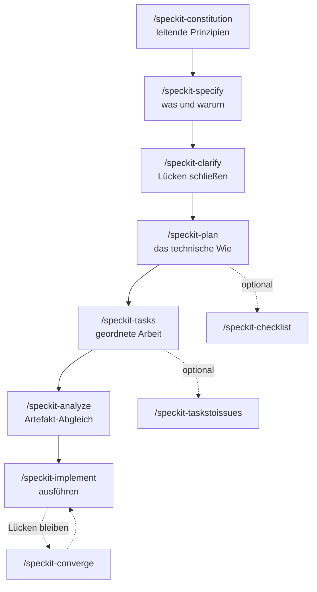

Aus einem einzigen Repository, [`nolte/claude-shared`](https://github.com/nolte/claude-shared), liefere ich 64 Claude-Code-Skills und 60 Agents aus. Dahinter liegt ein Korpus aus 114 Spezifikations-Themen. Den nächsten Skill zu ergänzen ist längst nicht mehr das Schwierige. Korpus und Skills ehrlich zueinander zu halten, schon.

Deshalb habe ich einen Tag in [GitHubs Spec Kit](https://github.com/github/spec-kit) gesteckt. Das Werkzeug schlägt eine feste Befehlskette vor, die aus einer Idee fertigen Code macht. Dieser Beitrag geht die Kette Befehl für Befehl durch, sagt zu jedem, was er wert ist, und endet mit dem ehrlichen Teil: Mein Spike steht bei Schritt eins von sieben, vier Annahmen sind offen.

## Wovon ich ausgehe

Ungeordnet sind die Skills heute nicht. Jede Artefaktklasse hat genau einen Einstiegspunkt zum Autorieren, denn dieser Einstieg erledigt die Dublettenprüfung und baut die Indizes neu:

| Artefakt | Einstiegspunkt |
| --- | --- |
| Spezifikation unter `spec/` | `/nolte-shared:spec` |
| Skill oder Agent | `/nolte-claude-dev:skill-management` |
| Pull Request | `/nolte-shared:pull-request-create` |
| Repository-Gerüst | `/nolte-shared:project-structure-apply` |

Was fehlt, ist die Schicht zwischen „eine Spec existiert“ und „ein Skill setzt sie um“. Ein Spec-Thema ist eine stehende Norm und zerfällt nicht von selbst in geordnete Arbeitsschritte. Also passiert die Zerlegung in einer Chat-Sitzung — und Chat-Sitzungen sind keine Artefakte. Sechs Wochen später kann ich die Spec lesen und den Skill lesen, aber nicht die Überlegung, die beide verbindet.

Genau dort setzt Spec Kit an. Die README beschreibt Spezifikationen, die „become executable, directly generating working implementations rather than just guiding them“, getragen von „multi-step refinement rather than one-shot code generation“.

## Die Kette

`specify init --here` mit der Claude-Integration legt einen `.specify/`-Baum an und schreibt zehn Skills nach `.claude/skills/`. Die Claude-Integration arbeitet skill-basiert, nicht befehlsbasiert — `init-options.json` hält `"ai_skills": true` fest. Weil `integration.json` den `"invoke_separator": "-"` setzt, rufst du sie als `/speckit-plan` auf, nicht als `/speckit.plan`.

### `/speckit-constitution` — der Maßstab für alles Weitere

Dieser Befehl schreibt eine einzige Datei, `.specify/memory/constitution.md`, mit den Nicht-Verhandelbaren des Projekts. Ich habe ihn ausgeführt, und es ist der einzige Schritt, den ich fertig habe. Herausgekommen ist Version 1.0.0, heute ratifiziert, mit fünf Prinzipien:

1. **Spec-Anchored Change** — jede Änderung an Laufzeitcode, CI, Plugin-Assets oder Doku setzt entweder eine bestehende Spec um oder ist selbst eine Spec-Revision.
2. **English-Canonical Bilingual Parity** — Übersetzungen entstehen im selben Autorenschritt, nie in einem Folge-Commit.
3. **Isolated Working Copies** — der Hauptcheckout bleibt auf `develop`, jede Änderung passiert im Worktree.
4. **Green Gate Before Merge** — `task check` läuft lokal und in CI identisch.
5. **Distribution-Contract Plugin Scoping** — ein Plugin-Schnitt braucht ein anderes Publikum oder eine andere Laufzeitanforderung, niemals bloß thematische Nähe.

**Was das wert ist:** Nicht die Datei ist der Gewinn, sondern das `Constitution Check`-Gate in `plan-template.md`, ausgeschildert mit „Must pass before Phase 0 research. Re-check after Phase 1 design.“ Jeder spätere Plan wird damit zweimal an diesen fünf Prinzipien gemessen. Ein Verstoß, der trotzdem ausgeliefert werden muss, landet in einer **Complexity-Tracking**-Tabelle, samt Begründung und verworfener einfacherer Alternative. Das ist der Teil, den ich mir sonst nirgends kaufen kann: ein schriftlicher Beleg, warum die Abkürzung genommen wurde.

Der Befehl gibt außerdem einen Sync Impact Report aus, der benennt, welche abhängigen Artefakte nachzuziehen sind. Meiner hat drei Templates, die zehn gerenderten Skills und beide Runtime-Guidance-Dateien als bereits stimmig durchgewinkt — nichts blieb liegen.

### `/speckit-specify` — das Was, vor jedem Wie

Nimmt eine Feature-Beschreibung in natürlicher Sprache und schreibt `specs/NNN-<slug>/spec.md`. Pflichtabschnitte des Templates sind User Scenarios & Testing, Requirements, Success Criteria und Assumptions.

**Was das wert ist:** Es erzwingt die Trennung, die ich von Hand immer wieder einreiße. Wenn ich einen Skill direkt aus einem Spec-Thema schreibe, kommen „Was“ und „Wie“ im selben Absatz an — und das „Wie“ gewinnt. Eine Datei, die für Implementierungsdetails schlicht keinen Platz vorsieht, ist ein billiger Zwangsmechanismus.

**Was es für mich nicht löst:** Diese Feature-Specs sind nicht mein `spec/`-Korpus. Spec Kit kennt keine stehende Norm getrennt von Feature-Specs, und der eigene Monorepo-Leitfaden wird bei der verwandten Lücke deutlich: „Spec Kit does not provide a built-in base/inheritance mechanism.“ Der Rat dort — „duplicate or sync shared engineering rules per project“ — beschreibt genau das Problem, dessentwegen `claude-shared` überhaupt existiert. Meine Konstitution sagt es deshalb ausdrücklich: Unter `.specify/` liegt Arbeitsgerüst, der `spec/`-Korpus bleibt die normative Autorität, und eine der beiden Ebenen ist Wegwerfware.

### `/speckit-clarify` — höchstens fünf gezielte Fragen

Liest die aktuelle Feature-Spec, findet Unterbestimmtes, stellt maximal fünf Fragen und schreibt die Antworten in die Spec zurück.

**Was das wert ist:** Der billigste Schritt der Kette und der, dessen Auslassen ich am meisten bereuen würde. Die Antworten landen in der Datei statt im Chat-Verlauf. Genau das Artefakt, dessen Fehlen ich oben beschrieben habe.

### `/speckit-plan` — das Wie, unter Aufsicht der Konstitution

Erzeugt `plan.md` plus Design-Artefakte: Rechercheergebnisse, ein Datenmodell, einen Quickstart, Verträge.

**Was das wert ist:** der doppelte Constitution Check. Annahme **A4** meines Spikes fragt, ob dieses Gate eine rund 200 Zeilen lange Konstitution plus Zeiger in einen 114-Themen-Korpus überhaupt trägt — oder ob es das Kontextbudget des Plans sprengt. Hält es, bekomme ich ein automatisches Gewissen für jeden Plan. Hält es nicht, muss ich auf höchstens acht Prinzipien kürzen und den Rest rein referenziell führen.

### `/speckit-tasks` — geordnete Arbeit, die Parallelität kennt

Erzeugt `tasks.md`: abhängigkeitsgeordnete Aufgaben in Phasen (Setup, Foundational, je eine Phase pro User Story, Polish). Jede Zeile trägt einen `[P]`-Marker, wenn sie parallel laufen kann, und ein Kürzel wie `[US1]`, das sie an eine Story bindet.

**Was das wert ist:** Die Parallel-Marker sind der handfeste Gewinn. Parallele Worktrees sind bei mir ohnehin der Normalfall. Heute entscheide ich von Hand, welche zwei Arbeitsstränge sich gefahrlos nebeneinander vertragen. Ein erzeugter `[P]`-Marker macht aus dieser Ermessensfrage etwas Überprüfbares.

### `/speckit-analyze` — der Abgleich, den ich nicht habe

Eine nicht-destruktive Konsistenzprüfung quer über `spec.md`, `plan.md` und `tasks.md`, ausgeführt nach der Aufgabengenerierung.

**Was das wert ist:** Zu diesem Schritt habe ich bislang kein Gegenstück. Für Drift zwischen Spec und Code gibt es `spec-drift-audit`, aber nichts prüft, ob ein Plan noch zu der Spec passt, aus der er stammt — bevor eine Zeile Code entsteht. Das auf Artefaktebene zu fangen ist deutlich billiger als im Review.

### `/speckit-implement` — die Liste abarbeiten

Arbeitet `tasks.md` ab. Der mitgelieferte Workflow `.specify/workflows/speckit/workflow.yml` verdrahtet die Kette als `specify → Review-Gate Spec → plan → Review-Gate Plan → tasks → implement`. Beide Gates sind menschliche Freigaben mit Abbruchoption.

**Was das wert ist:** ehrlich gesagt am wenigsten von allen sieben. Wenn eine Aufgabenliste erst einmal so konkret ist, erledigen meine bestehenden Skills die Arbeit ohnehin gut. Der Wert war in den sechs Schritten davor angefallen.

### Die drei optionalen

`/speckit-checklist` erzeugt eine fachlich zugeschnittene Qualitäts-Checkliste. `/speckit-taskstoissues` macht aus Aufgaben GitHub-Issues. `/speckit-converge` liest die Codebasis neu, vergleicht sie gegen Spec, Plan und Aufgaben und hängt alles noch nicht Gebaute wieder an `tasks.md` an. Der letzte ist der interessante: ein Rückweg für ein halbfertiges Feature — und in genau diesem Zustand sind die meisten meiner liegengebliebenen Branches.

## Wo der Spike tatsächlich steht

Zwei Commits auf einem Branch `exp/speckit-spike`. Einer richtet Spec Kit 0.14.3 ein, einer ratifiziert die Konstitution. Mehr nicht. Die Schritte zwei bis sieben sind gegen meine Skills nie gelaufen, und ich tue nicht so, als wäre es anders.

Der Spike existiert, um vier Annahmen zu widerlegen, bevor irgendeine Migration beginnt:

- **A1** — kopiert `specify extension add` einen ganzen Extension-Baum oder nur die unter `provides:` deklarierten Dateien? Das Schema kennt `commands` und `config`, sonst nichts. Ein Korpus aus 114 Themen lässt sich dort nicht deklarieren. Das ist die härteste Annahme des Vorhabens: Fällt sie, hat der Korpus in einer Extension keine Heimat und braucht einen eigenen Transportweg.
- **A2** — überlebt mein Skill-Frontmatter das Rendern nach `.claude/skills/`? Ein gerenderter Kern-Skill trägt genau `name`, `description`, `argument-hint`, `compatibility`, `metadata`, `user-invocable`, `disable-model-invocation`. Keines meiner Routing-Felder — `use_when`, `tags`, `phase`, `summary_de` — taucht auf. Ein Beweis fürs Verwerfen ist das noch nicht, denn ein Kern-Befehl hatte diese Felder nie. `metadata` ist eine frei geformte verschachtelte Map und damit ein plausibler Träger.
- **A3** — ist `/speckit.nolte-media.image-generate` neben dem heutigen `/nolte-media:image-generate` ergonomisch zumutbar?
- **A4** — trägt der Constitution Check eine Konstitution dieser Größe, wie oben beschrieben?

Ein Befund fiel an, bevor die Arbeit überhaupt begann, und den gebe ich gern weiter. Ein `specify --version` im Worktree löste ein vollständiges `specify init --here` aus: kompletter `.specify/`-Baum plus zehn Skill-Dateien, aus einem scheinbar lesenden Aufruf. Der Hauptcheckout blieb unberührt, die Artefakte habe ich anschließend entfernt. Trotzdem gilt: `specify` nie ohne bewusst gesetztes Arbeitsverzeichnis aufrufen.

## Was ich bisher denke

Die Kette konkurriert nicht mit meinen Specs. Sie ist eine Schicht darüber. Die beiden Schritte, die ich selbst dann behalten würde, wenn die Migration nie kommt, sind `clarify` und `analyze` — die beiden, die Artefakte erzeugen, welche ich heute aus dem Gedächtnis rekonstruiere.

Was das Werkzeug nicht bietet, ist ebenso klar, und nichts davon ist ihm vorzuwerfen: kein stehender Normkorpus getrennt von Feature-Specs, keine Spec-Vererbung, keine Mehrsprachigkeit, kein Subagent-Primitiv. Mein Korpus ist zweisprachig, und 60 meiner 124 Artefakte sind Agents. Diese vier Lücken sind der ganze Grund, warum das hier ein Spike ist und keine Migration.

Der nächste Beitrag dazu meldet entweder vier beantwortete Annahmen oder eine verworfene Idee. Beides ist ein Ergebnis.
