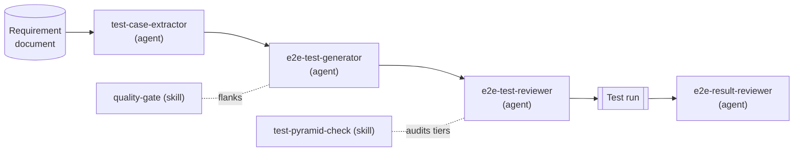

The [`kamerplanter`](https://github.com/nolte/kamerplanter) repo carries 70 Selenium end-to-end test files, backed by 58 page-object classes, plus a pytest backend suite and a vitest frontend suite. I wrote very little of that test code by hand. Claude Code agents scaffolded it against a spec, reviewed it against the same spec, and read the results back — one tier at a time.

This post starts a five-part series about that workflow. The claim it rests on is narrow: the reusable part of test automation is not the test code. It is the discipline that keeps a suite trustworthy — deriving cases from requirements, scaffolding suites the same way every time, reviewing them against fixed rules, and reading the results honestly. That discipline repeats, which is exactly what makes it a good fit for an agent. The boundaries — what each tier may test, when to stop pushing coverage down — stay with the spec and with me.

## The pyramid is responsibility, not weighting

The series walks the four tiers that `spec/project/e2e-test-automation/` defines in my shared plugin, [`nolte/claude-shared`](https://github.com/nolte/claude-shared) at `v0.1.5`: unit, integration, contract/API, and end-to-end.

The interesting word in "test pyramid" is not the shape. It is the layering. Each tier owns a kind of failure that a tier below it would catch worse.

Unit tests pin business logic in isolation. Integration tests cover critical paths with real dependencies. Contract tests guard each API endpoint, when the system exposes one. End-to-end tests walk user journeys through the real UI.

The spec states the rule plainly: a feature's tests must cover the applicable tiers rather than piling coverage into slow browser tests, and the E2E tier must be reserved for user-journey verification, not for logic that a faster tier pins down. That single rule is what stops a suite from rotting into a pile of brittle clicks.

## One chain of agents per feature

The shared plugin turns those tiers into a pipeline. Each link is a Claude Code agent or skill with a narrow job:

The chain reads left to right. `test-case-extractor` turns a requirement into framework-agnostic test cases — user-observable behaviour only, no HTTP codes or database state. `e2e-test-generator` scaffolds those cases into a spec-conforming suite. `e2e-test-reviewer` grades an existing suite and applies minimal, intent-preserving fixes — it repairs, it does not regenerate. After a run, `e2e-result-reviewer` reads the screenshots and the protocol as a human reviewer would, and reports findings keyed to each test-case ID.

Two skills flank the chain rather than sit inside it. `quality-gate` runs lint, typecheck, and tests together and tabulates what failed. `test-pyramid-check` audits whether the applicable tiers are present at all — and flags a missing tier as a gap, or records a tier that genuinely does not apply as `n/a` with a reason.

What I like about this split is that each agent has one responsibility and a fixed tool set. The generator may write test files but never touches the app to add a missing hook. The result-reviewer is read-only — it judges a finished run and cannot rerun it to make a finding go away.

## Framework-neutral, with one reference profile

The spec is careful about a trap I have fallen into before: hard-coding a single test stack into the rules. The binding core — page objects, deterministic waits, a locator hierarchy, screenshot checkpoints, a machine-written protocol, spec traceability — is expressed without naming a library. Selenium plus pytest is the normative reference profile for Python projects, not a mandate. Swap in Playwright or Cypress and the same six disciplines still apply.

I will spend the whole E2E article on those six disciplines. For now the short version is the locator rule, because it is the one most teams get wrong: prefer `data-testid`, then an element ID, then a semantic or role selector, then CSS, and only then XPath — with position-based XPath ruled out entirely.

## What this looks like in a real repo

`kamerplanter` is the running example for the series. It is a self-hosted plant-lifecycle system: a Python and FastAPI backend, a React and TypeScript frontend, and a Selenium E2E layer. The test code is real and so are the numbers I will quote.

The E2E suite carries 70 `test_req*.py` files and 58 page-object classes. Every test maps back to a spec test case by ID — a docstring like `TC-REQ-002-001` points at `TC-002-001` in the requirement's test-case document. A run writes screenshots at named checkpoints and a Markdown protocol with metadata, a pass/fail summary, and the per-requirement coverage. None of that is bolted on after the fact; it is what the generator scaffolds and what the reviewer checks for.

The repo also keeps project-local Claude agents next to the shared ones — `unit-test-runner`, `selenium-test-generator`, `e2e-testcase-extractor`. They predate the shared plugin and do the same jobs a tier at a time. Part of this series is the story of folding the local versions into the shared spec.

## The honest part: the pyramid is lopsided

If I only showed you the E2E numbers, I would be selling you a clean pyramid that does not exist. The real shape in `kamerplanter` is lopsided. The integration tier is a single file, and it does not run in CI because it needs a live database. The contract/API tier is four files, and the standard backend CI job does not run them either — it runs the unit tier only.

I am leaving that in on purpose. The pyramid an agent helps you build is the pyramid your project actually has, not the diagram on a slide. A tier that is thin for a real reason is more honest than a tier padded to look balanced. Each tier article will say where the example is strong, where it is thin, and what an agent can and cannot do about it.

## What's next

Four articles follow this one, one per tier:

- **Unit** — the fast tier: pytest and vitest, the `unit-test-runner` agent, and the `quality-gate` skill.
- **Integration** — critical paths with real dependencies, and why this tier stays thin.
- **Contract/API** — guarding each endpoint, and the gap between "tests exist" and "tests run in CI".
- **E2E** — the six disciplines in full: page objects, waits, locators, screenshots, the protocol, and traceability.

The thread through all four is the same as this one. The agent does the repeatable discipline. The spec, and the person reading the diff, decide what the discipline is for.
