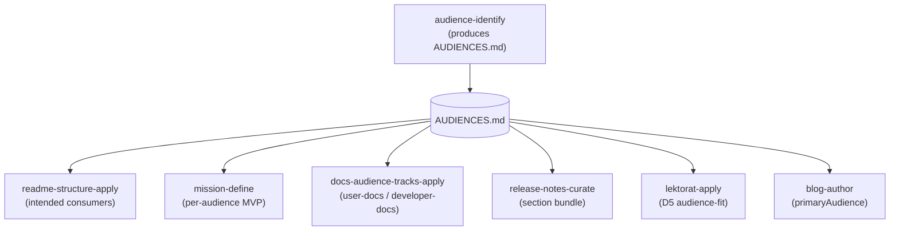

Open any README I've written in the last year and near the top sits a line about who it's for. That line isn't decoration. It's the output of a step I run before the README exists: I define the project's audiences first, write them down, and only then decide what each doc, spec, and release note should say. This post is about that step — what it produces, which tools depend on it, and why skipping it quietly breaks everything downstream.

The method lives in a spec in my shared Claude Code plugin, [`nolte-shared`](https://github.com/nolte/claude-shared), at `spec/project/audience-identification/`. If you haven't met the plugin, the [baseline post](/blog/claude-shared-baseline) covers why one shared plugin sits across every repo. This post is about one process inside it: naming the reader.

## The problem it solves

A project is read, run, extended, and constrained by more than one group. A library has people who call it and people who package it. A service has users, the operator who hosts it, and maybe a compliance reviewer who never touches the code. The spec opens with exactly this point: without a disciplined way to enumerate audiences, decisions about documentation depth, API surface, and release cadence get made against the author's private assumptions.

That last phrase is the whole problem. "Private assumptions" means the audience lives only in my head. The README ships at a depth I guessed. The release note speaks to a reader I never named. Nobody can check the guess, because it was never written down.

So the fix is almost boring: write the audience down first. Make it an artefact other work can point at.

## What "defining the audience" actually means

It isn't a marketing persona and it isn't a demographic. The spec is strict about the shape, and that strictness is what makes the list reusable.

It **starts with a bounded context** — a written declaration of what the project *is*, where its edges run, and what sits outside. You can't list a project's audiences until you've said what the project is. So the artefact opens with "inside the boundary" and "outside the boundary" before a single reader is named.

Then it **enumerates audiences under five relationship categories**, and any category that doesn't apply is recorded as "none" *with a reason* — never silently dropped:

- **Direct consumers** — who calls the interface (a human, another service, a downstream library).
- **Operators** — who runs, deploys, or hosts it.
- **Contributors / maintainers** — who changes the code or writes its content.
- **Governing parties** — legal, compliance, security, or architecture review with constraint authority.
- **Indirect audiences** — people affected without ever touching it, like the end users behind a service I consume.

Every audience that makes the list carries the same fields: a short label, its category, the surface it interacts through (API, CLI, dashboard, RSS feed), what it expects, the documentation `track` it maps to, and any open question. And each one is tagged `confirmed` — validated against a real representative or an authoritative source — or `assumed`, inferred by me. That single tag keeps the list honest about what I actually know versus what I'm guessing.

## What it looks like in practice

This blog has its own audience list, in `AUDIENCES.md` at the repo root. It's the worked example for everything above.

The bounded context says what the site is: a bilingual Astro blog that doubles as a personal knowledge base, deploying to GitHub Pages. Then the audiences. Direct consumers are technical readers (**A**), portfolio reviewers (**B**), and me reading my own knowledge base later (**C**). Operators are me as the site maintainer (**D**) and Claude Code as my co-author (**E**). Contributors are recorded as "none — strictly personal blog". Governing parties are "none" too — but with a tracked open question, because EU AI Act rules on synthetic-content disclosure might change that. Indirect audiences are the people I name in posts (**L**) and the search-engine and LLM crawlers that index them (**M**).

None of those entries is `confirmed` yet — they're all `assumed`, and the file says so out loud. That's not sloppiness. It's the spec working: I haven't validated any of them against real traffic, so the list refuses to pretend I have.

## Who consumes the list — and why it has to come first

Here's the rule that gives the whole thing teeth. The audience list **must exist before** any downstream artefact that claims an audience is written. The README, the mission statement, the roadmap, the release notes, the docs — each of those serves a reader, so each must point at the list instead of inventing its own.

In my plugin that's not a guideline, it's wiring. A spread of skills and agents read the same `AUDIENCES.md`:

The `audience-identify` skill produces the artefact. Everything else consumes it. `readme-structure-apply` builds the "intended consumers" section from it. `mission-define` asks for a deliverable per audience. `docs-audience-tracks-apply` reads each audience's `track` field to decide whether a page is user-facing or developer-facing. `release-notes-curate` shapes its sections around who reads them. Even the editor, `lektorat-apply`, has a dimension — D5, audience-fit — that checks whether a page actually matches the reader it claims.

This very post is downstream too. Its frontmatter carries `primaryAudience: A`, and the authoring skill picked the depth and the opening from that audience's rubric — because the list told it who **A** is.

## Why it matters that they observe it

The payoff is one source of truth. When seven tools read the same file, the reader is defined once and never re-guessed. Change the audience list and every consumer changes with it. Skip it and each tool falls back to a private guess again — exactly the failure the spec set out to kill.

Three smaller things make the discipline hold:

**"None with a reason" beats silent omission.** Writing "contributors: none — personal blog" is a decision on the record. Leaving the category blank looks identical on the page but means I never thought about it. The first can be reviewed; the second can't.

**`confirmed` versus `assumed` stays honest.** A list that quietly upgrades every guess to fact is worse than no list. Tagging each entry forces me to admit what I haven't checked — and gives a future me a cheap to-do: confirm the assumptions.

**Drift gets caught.** The audience list lives in git next to the code, and a separate skill, `spec-drift-audit`, flags a project whose documented audiences no longer match its real interaction surface. Add a public API or a newsletter, and the list is supposed to grow with it. The audit is what notices when it didn't.

None of this is heavy. The artefact is one Markdown file, and the method scales down — a small module can fold its audiences into a README section instead of a standalone file. What doesn't scale away is the order: name the reader first, write for them second. Every doc I ship is only as well-aimed as the list it points at.
