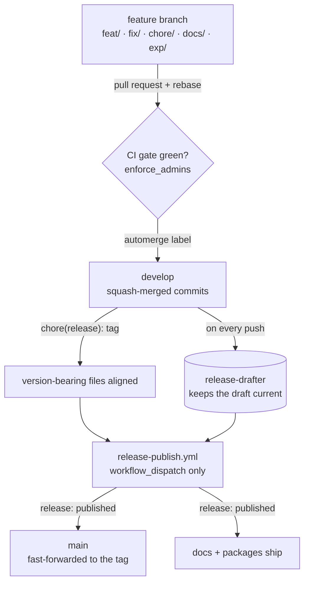

If you open `main` in any of my repositories, you are not looking at work in progress. You are looking at exactly what I last released — no more, no less. That is not a coincidence and it is not discipline on my part. It is the output of a pipeline that moves every change along the same fixed path, from a feature branch to a published GitHub Release.

This post walks that path station by station. I will show the two branches and the jobs they do, how a single change earns its way onto the integration branch, how a release is actually cut, and how the packages and documentation ship afterward. The same shape repeats across the portfolio, so once you have seen it once, every repo reads the same way.

## Two branches, two very different jobs

The whole model rests on splitting two responsibilities that most repos blur together.

`develop` is the integration branch. Every feature, fix, and chore lands here through a pull request, and this is the only branch where work in progress is allowed to exist. If something is half-finished, it lives on a feature branch that targets `develop`.

`main` is a presentation branch. It always reflects the most recently published GitHub Release, and nothing else. No human commits to it, pushes to it, or merges into it. The branch is written by exactly one actor: the release automation. Editing a file directly on `main` is not a shortcut — it is a bug.

That rule sounds strict, but it buys something concrete. Anyone — a teammate, a future me, an AI agent reading the repo — can look at `main` and trust that it shows the last shipped artifact, never an in-between state.

Feature branches carry one of five prefixes: `feat/`, `fix/`, `chore/`, `docs/`, or `exp/`. The prefix is not decoration. It matches the type the pull-request title will use, written in Conventional Commits — the commit-message convention that drives the automated changelog — so the branch name and the commit type line up without translation. The `exp/` prefix is the odd one out: it marks throwaway, time-boxed exploration that is never meant to ship as a stable feature. This blog adds one local prefix on top of the five — `post/` for new entries — which is why the change you are reading rode in on a `post/` branch.

## How a feature actually lands on develop

A pull request is the only way into `develop`, and it has to clear a fixed set of gates before it merges.

The branch has to be current first. Before the PR opens, I rebase it onto the tip of `develop`, and if `develop` moves while the PR is open, I rebase again. GitHub enforces this too, through the "require branches to be up to date" setting, so the CI run always reflects the state that will exist after the merge.

The description is not freeform. Every PR uses a template with five sections in a fixed order: Summary, Changes, Linked issues, Testing, and Risk / rollout notes. A lint workflow checks both the title and the body on every push, and it is a required check — a malformed title or a missing section fails the build.

Then the CI gate decides. Every required status check has to report green on the head commit, and there is no override path: `enforce_admins` is on, so not even an admin can merge past a red check.

When everything is green, I apply the `automerge` label, and a reusable workflow squash-merges the PR — collapsing its commits into one. One PR becomes exactly one commit on `develop`, carrying the Conventional Commits title as its message.

A few smaller rules keep the history clean. If a check goes red, I fix it forward with a new commit rather than force-pushing over the old one, because a force-push destroys review context. Merges are squash-only — merge commits and rebase-merges are disabled in config. And the feature branch deletes itself on merge, so the remote never collects dead branches.

```yaml
# .github/settings.yml — the rules live as code, synced by the Probot Settings app
allow_squash_merge: true
allow_merge_commit: false
allow_rebase_merge: false
delete_branch_on_merge: true
```

## Cutting a release from develop

Here is the part that surprises people: releases are cut from `develop`, never from `main`.

While PRs land on `develop`, a workflow called `release-drafter` keeps a draft GitHub Release up to date. It reads the squash-merged Conventional Commits messages and sorts them into a changelog under the next version tag. The draft is always there, always current — I never assemble release notes by hand.

Before that draft can be published, the version has to be written into the files that declare it — `package.json`, `pyproject.toml`, a plugin manifest, depending on the project type. That alignment lands on `develop` as a single commit with the subject `chore(release): <tag>`. The publish step refuses to proceed unless every version-bearing file matches the tag, so a forgotten bump blocks the release instead of shipping a lie.

The actual flip from draft to published happens in `release-publish.yml`. It triggers on `workflow_dispatch` only — never on a push or a schedule — because deciding *when* to ship is a deliberate human act. The workflow runs a set of pre-publish checks (exactly one open draft, the tag reachable from `develop`, the version files aligned, every required check green) and only then flips the release to published. Nobody runs `gh release edit --draft=false` by hand; that path exists only as an emergency fallback when the workflow itself is broken.

Publishing the release is what finally touches `main`. A third workflow, `release-cd-refresh-master.yml`, fires on `release: [published]` and fast-forwards `main` to the released commit — moving the branch pointer forward without creating a merge commit. That is the only write `main` ever sees, and it is mechanical. The loop closes: `main` now equals the release that was just published.

I do not have to remember all of this. Two small skills sit on top of the workflows for ergonomics — `release-notes-curate` augments the draft body with project-context sections, and `release-publish-trigger` validates every pre-publish gate locally and then dispatches the workflow. Neither one is allowed to publish directly; the workflow stays the single audited entry point.



## Publishing the packages and the docs

A published release is also the signal for everything downstream. Both docs and packages hang off the same `release: [published]` event, so they only ever ship from a real, tagged release.

Documentation goes out through `release-cd-deliver-docs.yml`. When a repo has an `mkdocs.yml`, this workflow rebuilds the MkDocs site on every published release and pushes it live. The docs you read are always tied to a release, not to whatever happens to be on `develop` that day.

Packages depend on what the repo actually ships, and each project type has its own artifact shape. A Home Assistant integration patches its `manifest.json`, builds a ZIP, and uploads it to the release for HACS — the Home Assistant Community Store — to pick up. A Python library publishes a distribution. A containerized app pushes an image tag to `ghcr.io`. The release spec pins down, per project type, exactly what a valid artifact looks like and which checks confirm it exists — a Git tag alone is not enough when the real deliverable is a package.

All of these are repo-specific packaging workflows, but they share the trigger. Nothing publishes on a merge to `develop`; everything waits for the release. That is what keeps a published version, its docs, and its packages describing the same commit.

## What this costs

I do not want to sell this as free, because it is not.

The biggest cost today is the version-alignment step. In the ideal flow a workflow with a provisioned token writes the `chore(release): <tag>` commit itself, but until that credential is provisioned across the portfolio, I do it by hand: open a small PR, let it pass the same gate as everything else, and squash-merge it through the UI. It works, but it is a manual link in a chain that is otherwise automated.

There are platform sharp edges too. A release published under the default token does not always cascade to the downstream refresh as a fresh workflow run — a known GitHub Actions behavior that the same credential work will fix. Until then I keep an eye on whether `main` actually moved after a publish.

And the model only pays off if you hold the line. The moment someone commits to `main` directly "just this once," the guarantee that `main` equals the last release is gone, and every reader who trusted it is now wrong. The strictness is the feature.

## What I keep

What I get for the cost is a repository that explains itself. The branches mean exactly one thing each. A change has exactly one way in. A release is a button press over checks I can read, not a ritual I half-remember. And `main` is a fact, not a hope — it is the last thing I shipped, kept honest by the machine instead of by my memory.

That is the whole point of writing it down as workflows: the path is the same every time, for me and for every agent that picks up the repo after me.
