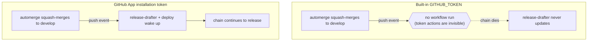

Every GitHub Actions workflow runs with a token it never asked for. GitHub injects it as `secrets.GITHUB_TOKEN`, scopes it to the repository, and throws it away when the run ends.

For most jobs that is exactly right — my lint and build pipelines use nothing else. So when people see that my merge and release workflows also mint a token from a custom GitHub App, the fair question is: why bother? The built-in token is free, automatic, and already there.

The short answer is that the built-in token is designed to be blind to its own actions. It cannot trigger the next workflow in a chain, and it cannot act as one stable identity across more than the single repo it was issued for. Both limits are intentional, both are good defaults, and both are exactly the wrong behavior for a pipeline whose whole job is to hand work off to the next pipeline. This post is about that gap and why a GitHub App closes it.

## What the built-in token actually is

`GITHUB_TOKEN` is not a secret you create. At the start of every workflow run, GitHub mints a fresh installation token, hands it to the job, and revokes it the moment the run finishes. It is ephemeral by design — there is no long-lived credential sitting in your settings to leak.

Its permissions are scoped two ways. They are limited to the repository that contains the workflow, and they are capped by whatever `permissions:` block the workflow declares. My CI workflow asks for the least it can:

```yaml
# .github/workflows/ci.yml — a classic pipeline, nothing more needed
permissions:
  contents: read
```

That job reads the code, type-checks it, builds it, and is done. It never writes anything, never opens a PR, never has to wake another workflow. For that shape of work the built-in token is not just adequate — it is the correct choice, and adding an App would be pure overhead. Keep that in mind for later: the goal is not "Apps everywhere." It is "an App exactly where the built-in token can't reach."

## The wall: token actions don't trigger workflows

Here is the behavior that catches everyone out, straight from how GitHub Actions is built: **events triggered by the `GITHUB_TOKEN` do not start a new workflow run.** If a job authenticated with the built-in token pushes a commit, that push fires no `push` workflows. If it publishes a release, that release fires no `release` workflows.

This is a deliberate guard against infinite loops. Without it, a workflow that commits on `push` would re-trigger itself, push again, trigger again, forever. GitHub breaks the recursion by making the built-in token's actions invisible to the event system. Sensible — right up until you actually *want* one workflow to wake the next one.

My automation is a chain of exactly those hand-offs:

- A pull request earns its `automerge` label, and a workflow squash-merges it onto `develop`. That merge is a push to `develop` — and the push is supposed to wake `release-drafter` and the deploy job.
- A release is flipped from draft to published. That publish is supposed to wake the workflow that fast-forwards `main` to the released commit.

Run those merges and publishes under the built-in token and the chain dies silently at every joint. The merge lands, but the draft release never updates. The release publishes, but `main` never moves. Nothing errors — the next workflow never runs, because as far as the event system is concerned, nothing with a real identity did anything.

## What a GitHub App gives you instead

A GitHub App is a first-class actor on the platform. You register it once, give it a set of fine-grained permissions, and install it on the repos that need it. At runtime a workflow exchanges the App's ID and private key for a short-lived installation token — just as ephemeral as the built-in one, but issued under the App's identity rather than the run's.

That difference in identity is the whole point. Because the token belongs to the App and not to `GITHUB_TOKEN`, the actions it performs are *not* exempt from the event system.

A push the App makes is a real push. A release the App publishes is a real release. The next workflow in the chain wakes up exactly as it should.

So my merge pipeline carries both tokens, and hands the App credentials to the reusable workflow that does the actual merge:

```yaml
# .github/workflows/automerge.yaml
jobs:
  automerge:
    uses: nolte/gh-plumbing/.github/workflows/reusable-automerge.yaml@v1.1.19
    with:
      app-id: ${{ vars.PORTFOLIO_APP_ID }}
    secrets:
      token: ${{ secrets.GITHUB_TOKEN }}
      app-private-key: ${{ secrets.PORTFOLIO_APP_PRIVATE_KEY }}
```

The `app-id` and `app-private-key` are the only ingredients you need to mint an installation token. The reusable workflow trades them for one, merges the PR under the App's identity, and that merge's push to `develop` is now visible to `release-drafter` and the deploy job. The release-publish workflow is wired the same way, for the same reason — its publish has to cascade into the job that refreshes `main`.

There is a second, quieter benefit. The built-in token only ever speaks for the one repo that issued it. The App is registered once at the account level and installed across the whole portfolio, so every repo's automation runs under the *same* identity with the *same* curated permission set — managed in one place, not re-declared per repo. When a credential needs rotating or a permission needs tightening, that happens once for everything, instead of once per repository.



## Two kinds of app, one primitive

It is worth being precise, because "the app" can mean two different things in my repos, and both are GitHub Apps under the hood.

The first is the one above: a custom App whose token my workflows mint to act with a triggering identity. It exists to move work along the pipeline.

The second kind is the Probot apps — `settings`, `boring-cyborg`, and `stale`. Probot is a framework for building GitHub Apps that react to events, and these three react to keep configuration honest. The `settings` app, for example, reconciles my branch protection and repo options from a checked-in file every time the default branch moves:

```yaml
# .github/settings.yml — reconciled by the Probot "settings" app
_extends: nolte/gh-plumbing:.github/commons-settings.yml@v1.1.19
repository:
  default_branch: develop
  allow_squash_merge: true
  allow_merge_commit: false
```

I could, in principle, write a classic workflow that calls the REST API to enforce all of that on a schedule. But then I am back to maintaining token permissions, cron triggers, and idempotent API calls by hand — rebuilding, badly, an App that already exists and does exactly this. The Probot apps are config-as-code without the plumbing, which is the same trade as before: reach for an App when the built-in token's model doesn't fit, not as a reflex.

## Where classic pipelines stay

I want to be honest that this is not a verdict against the built-in token. Most of my workflows still run on it, and should.

CI runs on `contents: read` and never needs more. The GitHub Pages deploy uses the platform's own OIDC (OpenID Connect) identity, not an App.

The release-drafter job that keeps the draft current runs on the built-in token too, because updating a draft does not have to cascade into anything — it is an endpoint, not a joint in the chain. The App shows up at precisely two places: the merge and the publish, the two moments where one workflow's output has to become another workflow's trigger. Everywhere else, reaching for an App would add a private key to rotate and an installation to maintain in exchange for nothing.

## What it costs

The App is not free either, and pretending otherwise would be dishonest.

You register and install it, then store its private key as a repository or organization secret — a long-lived credential that the ephemeral built-in token specifically spared you. That key has to be guarded and eventually rotated. And the indirection is real: a newcomer reading `automerge.yaml` sees two tokens and a reusable workflow and has to understand *why* before the wiring makes sense, which is part of what this post is for.

There is also a transition cost while the App is still being provisioned across every repo. Until the credential is wired up everywhere, a few steps that the App is meant to automate — like writing the version-alignment commit before a release — stay manual, and I keep an eye on whether downstream workflows actually fired after a publish. That gap closes as the rollout finishes, but today it is a real seam.

What I get for the cost is a pipeline that actually behaves like a pipeline: each stage hands off to the next without me standing at the joint, nudging it through by hand. The built-in token is the right default for work that ends where it starts. The App is what you reach for the moment a workflow's job is to start the next one.
