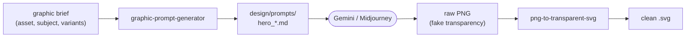

This blog already knows how to show a hero image. It just has none. Every post can carry a `heroImage`, the layout turns it into an Open Graph card, and so far not one post sets the field. This is the post where I describe the pipeline I'm building to fix that — and the prerequisite that stopped me on the first run.

## The wiring that already exists

The content schema has carried the field from the start. In `src/content.config.ts` the posts collection declares it as optional:

```ts
heroImage: z.string().optional(),
```

`PostLayout.astro` hands that value to the base layout as the Open Graph image:

```astro
ogImage={post.data.heroImage}
```

And `BaseLayout.astro` only emits the meta tag when a value is present:

```astro
{ogImage && <meta property="og:image" content={ogImage} />}
```

So the contract is simple: drop a path into `heroImage`, and the post gets an OG card on every social unfurl. Nothing renders the image, nothing generates it. That part was always meant to be a separate job, and I did not want to do it by hand each time.

## Why two agents, not one tool

I run Claude Code with a shared plugin across my repos, [`nolte/claude-shared`](https://github.com/nolte/claude-shared). Two of its agents cover the two halves of "get an image" that have nothing to do with each other:

- writing a prompt that actually matches the brand, and
- turning whatever the generator spits out into a clean asset.

They stay separate because they fail in different ways and at different times. The first is a writing task. The second is image processing. Splitting them means each runs against a freshly loaded, narrow context instead of one agent juggling brand tokens and pixel thresholds at once.



The prompt document in the middle is the point. It sits on disk, in version control, so the image is reproducible — I can regenerate it later from the same prompt instead of re-inventing what I asked for.

## Agent one: the brand-conformant prompt

The [`graphic-prompt-generator`](https://github.com/nolte/claude-shared/blob/027427f/agents/graphic-prompt-generator.md) takes a brief — asset type, subject, light or dark variants, dimensions, and exactly one target generator — and writes a Markdown prompt document under `design/prompts/`. It never calls a generator itself. Its output is text to paste into Gemini or Midjourney.

What makes it more than a template is the order it enforces. Every prompt is assembled the same way:

1. a canonical style reference,
2. descriptive color phrases drawn from an approved vocabulary, never a raw hue pick,
3. the brand hex values appended as reinforcement,
4. a seed slot, recorded even when it is unset.

It also adds an avoidance clause — no embedded text, no other companies' logos, no watermark — and explicitly does not ask the generator to render legible copy. Text overlay is a post-processing step, because generators are bad at letters. Light and dark variants re-pull the per-mode tokens rather than inverting colors, which is the difference between a real dark-mode asset and a washed-out one.

## The prerequisite I hit first

Here is where the first run stopped, and it is the honest part of this post. Before the agent assembles anything, it loads the consuming repository's brand sources: a published design-token bundle and a `brand-vocabulary.md` that pairs descriptive phrases with those tokens. If neither exists, the agent stops and reports the missing source. It does not invent colors.

This blog has no design tokens and no `brand-vocabulary.md`. There is no `design/` directory at all. So on this repo, agent one halts at its first phase — correctly.

The lesson landed before any image did: the pipeline assumes a brand layer this site has not defined yet. The next piece of work is not generating images. It is writing down what "on-brand" even means here.

## Agent two: the fake-transparency trap

The second agent solves a problem I would not have predicted. AI image generators routinely emit PNGs with a checkerboard pattern that *looks* like transparency but is painted straight into the RGB channels, with `alpha=255` everywhere. A vectoriser sees that checkerboard as legitimate content and bakes it into the output. The result is a full-canvas checkerboard behind the motif.

[`png-to-transparent-svg`](https://github.com/nolte/claude-shared/blob/027427f/agents/png-to-transparent-svg.md) detects that pattern before vectorising. It samples the corner pixels, classifies the background as a grey checkerboard or a flat color, rewrites the qualifying pixels to `alpha=0`, and only then runs the cleaned PNG through [vtracer](https://github.com/visioncortex/vtracer). Afterwards it strips any full-canvas background path the vectoriser still emits.

It reports a diagnosis per file before touching anything. It also applies a sanity check worth stealing: a typical icon is 70 to 90 percent background, so if fewer than 30 percent of pixels get removed, that is a red flag it surfaces instead of pressing on. It also never overwrites the input — the cleaned PNG is a new file.

## Where this leaves the blog

The pipeline is sound and the agents are real. What is missing is upstream of both: this blog needs a brand definition before agent one will run, and only then does agent two have something to clean. So the next commit here is not a hero image. It is a `design/` directory with tokens and a color vocabulary — the thing the prompt generator asked for and did not find.

I would rather ship that order than fake a brand into a single throwaway prompt. The whole reason for the prompt-document-on-disk design is consistency across every future image, and you do not get consistency by guessing the palette once.
