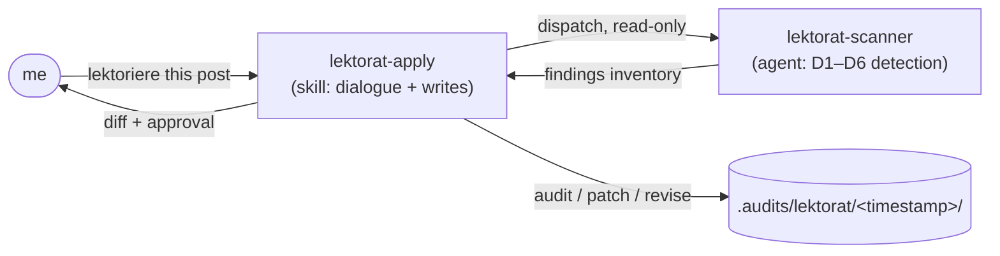

Every post on this site is AI-drafted and then curated by hand. The drafting I trust; the curation I don't want to do by eyeball — reading every paragraph for sentence length, undefined jargon, and register drift is the work I'm bad at being consistent about. So I handed it to a tool: `Lektorat`, the editorial layer in my shared Claude Code plugin, [`nolte-shared`](https://github.com/nolte/claude-shared). It reads a post before I publish it.

If you haven't met the plugin yet, the [baseline post](/blog/claude-shared-baseline) covers why one shared plugin sits across every repo. This post is about one capability inside it: the editor.

## What an editor actually has to check

The hard part of editing isn't fixing a typo. It's holding several unrelated checks in your head at once and applying them evenly across a whole document. Lektorat names those checks as six dimensions, defined in the spec at `spec/project/lektorat/`:

- **D1 — readability.** Are sentences and paragraphs the right length for the page's job?
- **D2 — comprehensibility.** Is there jargon, an unexpanded acronym, or a hidden prerequisite the reader can't resolve?
- **D3 — spelling and grammar.** The mechanical layer.
- **D4 — style.** Active voice, consistent tense, sentence-case headings, no register that flips halfway through.
- **D5 — audience-fit.** Does the page match the audience it claims to serve?
- **D6 — idiomatic naturalness.** Does the text read like it was written in its own language — or do calques and foreign sentence patterns show through?

Every finding is one of three severities: `critical`, `warning`, or `suggestion`. That ordering is what makes a report actionable — I fix the criticals, I read the warnings, and I treat suggestions as optional.

The dimensions aren't all hand-rolled heuristics. D1 leans on **LIX**, a readability metric computed the same way for English and German, with a target corridor that depends on the page type. D3 and D4 for English come from [Vale](https://vale.sh); the German side defaults to a LanguageTool HTTP endpoint. Lektorat consumes those tools — it doesn't reimplement them.

## Three ways to run it: audit, patch, revise

The same six-dimension check drives three operations, and picking the right one is most of using the tool well.

`audit` is read-only. It scans the target, writes a report, and touches nothing else. It's safe to run unattended — in a pre-commit hook, a release gate, or just because I want to know how bad a backlog is.

`patch` is the interactive fixer: one finding, one diff, one approval. It walks the findings in severity order and shows me a unified diff (a patch format that shows the changed lines with surrounding context) for each. I `approve`, `skip`, or `skip-and-record` — the last one writes a permanent dismissal so the finding never resurfaces. It never bundles two fixes into one edit.

`revise` is the heavy one: a full-artefact rewrite that addresses every `critical` and `warning` finding in a single pass, shown to me as one diff to accept or reject. Its rule is strict — it may rephrase, but it must keep every fact, claim, command, link target, and code block from the original. It's forbidden from inventing new content to round out a sentence.

## The split: a skill that talks, an agent that reads

Lektorat is two pieces, and the boundary between them is deliberate. `lektorat-apply` is a skill — it talks to me, runs the approval dialogues, and owns every write to disk. `lektorat-scanner` is an agent it dispatches for the detection pass, and that agent is read-only by construction: its tool list is `Read`, `Grep`, `Glob`, `Bash`, with no `Edit` or `Write` at all.

The reason for the split is that "an editor that can silently rewrite what it finds" is the wrong shape. By moving detection into a tool-restricted agent, the read-only promise of `audit` is enforced by the runtime, not just by good intentions. The agent can't write even if it wanted to. The skill stays in the conversation to show diffs and wait for my `approve`.

## Running it on this post

Here's the actual loop. I ask for it in plain language — the skill triggers on phrases like "lektoriere this post" or "audit the docs for readability", in English or German. It resolves which language rules apply per file (English rules on the English file, German rules on the German one), reads the audience artefact to know who the page serves, then dispatches the scanner.

What lands on disk is an audit trail under `.audits/lektorat/<YYYY-MM-DD-HHMM>/`. The two files I open are `findings.json` (machine-readable, stable across runs) and `summary.md` (severity-sorted, human-readable). A `run.json` records what I asked for. If I run `patch`, dismissals collect in `dismissals.json`; if I run `revise`, the pre- and post-rewrite reports sit beside a `rewrite.diff`.

This post is bilingual, so the audit covers both files as one pair. The English body gets a LIX reading and a Vale pass; the German translation gets its own LIX reading and the German grammar pipeline. A misspelled German word is a German finding on the German file — Lektorat never tries to "fix" a German sentence by making it English, and vice versa. That cross-language passage is flagged for me to decide, not silently rewritten.

The honest part: this very post went through that loop before it reached you. The authoring skill hands the finished pair to `lektorat-apply` as its last step, I read the summary, fixed the criticals, and dismissed the warnings I disagreed with — on the record, in the handover file that ships in the same commit.

## What it refuses to do

The guardrails are where I gained trust. Lektorat won't lektor anything under `spec/`, won't touch a skill's `SKILL.md` or an agent's definition, and won't edit source code, generated config, or lockfiles. Its scope is Markdown prose, full stop.

During `audit` it writes nothing outside the audit-trail folder. During any fix it preserves the structural invariants — code blocks, link targets, frontmatter key order, and the count and order of list items all stay byte-identical unless a finding explicitly targets them.

It also can't paper over a missing fact. `revise` is barred from adding a command, a path, a product name, or a URL that wasn't in the original — if the prose needs one, it stops and asks instead of inventing. And it never commits, pushes, or opens a pull request; the fixes land in my working tree and the rest is my call.

## Why I trust it more than myself here

A human editor — me, at 11pm — is inconsistent. I'll catch a long sentence on page one and wave through an identical one on page three. Lektorat won't. It applies the same corridor to every paragraph, records each finding with a stable ID so a dismissal I made last week still holds this week, and leaves an audit trail in git that says exactly what it checked and what I decided.

It isn't a replacement for reading my own work — it has nothing to say about whether an argument is any good. What it gives me is a consistency floor: the mechanical, audience, and readability checks happen the same way every time, so the judgement I do bring is spent on the part that actually needs a human. That trade is the whole reason the editor is a tool and not a chore.
