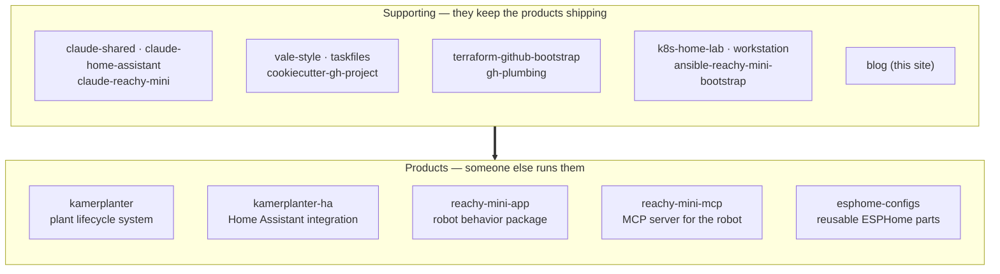

If you open my GitHub profile and sort by "recently pushed", you get a list that looks scattered: a plant-care system, a Kubernetes home lab, three Claude Code plugins, a Terraform bootstrap for the org itself, a robot behavior package. The snapshot below is the active, non-archived, non-fork set as of 2026-05-30. The scatter is real, but it resolves cleanly once you ask one question of each repo: who is it actually for?

That question splits the portfolio into two piles. One pile is software someone other than me is meant to install and run. The other pile exists so the first pile can ship and keep running. The second pile is much larger — and that ratio is the most honest thing the profile says about how I work.

## The test I apply to each repo

The split isn't "library versus application" and it isn't "big versus small". It's about the reader at the far end.

A repo is a **product** if its success is measured by someone else using it: a Home Assistant user who adds my integration, a robot owner who installs a behavior, a Model Context Protocol (MCP) client that talks to my server. A repo is **supporting** if its success is measured by my own work getting faster, safer, or more consistent — a shared Claude Code baseline, a Terraform definition of the GitHub org, a provisioning playbook.

The boundary occasionally blurs — a few supporting repos are public and reusable, so a stranger *could* adopt them — but the test holds on intent. I maintain `taskfiles` so my own builds stay consistent; if you vendor it too, that's a welcome side effect, not the reason it exists.

## The products: built for someone else to run

There are two product lines here, plus one outlier. Each names a reader I can picture.

**`kamerplanter`** is a plant-lifecycle system — the repo description calls it "agricultural technology system for plant lifecycle management", and its topics list FastAPI, React, Helm, and Kubernetes. That stack tells you the intended reader: someone who wants a real service to track plants over time, not a script. **`kamerplanter-ha`** is the same product line meeting people where they already are. It's a Home Assistant integration installable through HACS (the Home Assistant Community Store), so its reader is narrower and more concrete: a Home Assistant user who already runs a dashboard and wants plant data inside it rather than in a separate app.

The Reachy Mini line targets owners of the Reachy Mini robot. **`reachy-mini-app`** is a behavior package built on the Pollen Robotics / Hugging Face `reachy_mini` SDK — the reader is a robot owner who wants the robot to *do* something. **`reachy-mini-mcp`** is an MCP server that wraps the Pollen daemon in REST (HTTP/JSON). Its reader is one level more technical: someone wiring the robot into an MCP client or an automation, who needs an API surface rather than a packaged behavior.

The outlier is **`esphome-configs`**, described as "small reusable parts for works with esphome" and tagged `iot` and `smart-home`. Its reader is a smart-home tinkerer who already writes ESPHome YAML and wants building blocks instead of a finished firmware. It sits closest to the supporting pile — it's parts, not a product — but the parts are published *for other tinkerers*, so I count it as a product.

Five repos. That's the entire public-facing surface, and two of them are the same plant system wearing two faces.

## The supporting cast: built so the products can ship

Everything else is scaffolding. It groups into four jobs.

**Codifying how I work with Claude Code.** `claude-shared` is the cross-repo baseline — I wrote about [why it's one plugin](/blog/claude-shared-baseline) rather than a dozen drifting `CLAUDE.md` copies. `claude-home-assistant` and `claude-reachy-mini` extend that baseline with domain skills: the first for custom integrations, Lovelace cards, and blueprints; the second for the robot's dance-to-music behaviors and its Home Assistant tie-in. Their reader is me-with-Claude, and by extension any developer who installs the same plugins.

**Keeping docs, builds, and new repos consistent.** `vale-style` is a shared Vale vocabulary, `taskfiles` is a set of reusable `Taskfile` includes, and `cookiecutter-gh-project` is the template that stamps out a new repo with workflows already wired. These three exist so that starting project number twenty costs the same as project number two.

**Treating the GitHub org as code.** `terraform-github-bootstrap` defines the org's settings, teams, and branch-protection rulesets in Terraform; `gh-plumbing` carries the project-level plumbing on top. The reader is whoever administers the `nolte` org — today that's me, but the point of writing it down is that it no longer lives only in my head.

**Running the infrastructure underneath.** `k8s-home-lab` is the Kubernetes home lab — Kind or Talos, managed with ArgoCD and Argo Workflows — that the plant service can actually deploy onto. `ansible-reachy-mini-bootstrap` provisions the robot's Raspberry Pi over WiFi. `workstation` configures my own dev machine. And this `blog` is the shop window: the one supporting repo whose output is meant to be read rather than run.

## What the ratio actually says

Five products against roughly fourteen supporting repos isn't an accident, and for a technical reader it's the interesting part.

Each product sits on a stack of repos that never face a user. The Reachy Mini line is the clearest example: the app and the MCP server are the visible tip, but `ansible-reachy-mini-bootstrap` provisions the hardware and `claude-reachy-mini` is how I build the behaviors at all. Pull the supporting repos away and the products don't get smaller — they stop shipping. The plant integration needs the home lab to run on; the robot behaviors need the Pi provisioned and the Claude skills to write them.

I used to leave this layer implicit, scattered across local scripts and a personal `CLAUDE.md`. Making it explicit — each piece its own repo, with its own README and its own reader — is what lets the product repos stay small and legible. The scaffolding carries the weight so the products don't have to.

So if you're scanning the profile to judge what I build: read the five products for *what* I ship, and read the fourteen supporting repos for *how* I keep shipping it. The second list is the longer answer, and usually the more honest one.
