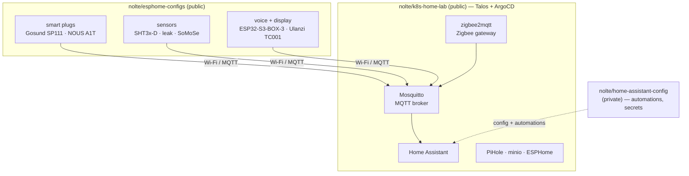

The lights, plugs, and sensors in my flat answer to no vendor's cloud. When a smart plug switches off because a water-leak sensor tripped, that decision is made on hardware I own, in software I can read, and nothing leaves the building to make it happen.

People hear "smart home" and picture an app and an account. Mine is a stack of Git repositories.

There are three of them, and they split along a line that turns out to be the whole story: two are public, one is private. This post is about what each repo does, and — since I deliberately opened two of them to the world — why being public is the part worth talking about.

## Three layers, three repos

A self-hosted smart home is not one project. It is at least three, stacked:

- **The devices** — the firmware on every plug, sensor, and display. This is [`nolte/esphome-configs`](https://github.com/nolte/esphome-configs), and it is **public**.
- **The platform** — the cluster that hosts the services the devices talk to. This is [`nolte/k8s-home-lab`](https://github.com/nolte/k8s-home-lab), and it is **public**.
- **The brain** — the personal automations, the layout of my actual home, the secrets. This is `nolte/home-assistant-config`, and it is **private**.



The arrows only point inward, toward services I run. That is what "cloud-less" means here in practice: a device's job is to reach a broker on my own cluster, not an endpoint on someone else's.

## esphome-configs: the devices, defined once

[ESPHome](https://esphome.io/) turns cheap ESP8266 and ESP32 boards into Home Assistant devices by compiling a YAML description into firmware. The naive way to run a dozen of them is to copy a full config per device and edit the differences. That rots fast.

`esphome-configs` is built the other way around. Every file under `src/*.yaml` is one physical device, and it stays tiny because it composes shared building blocks from `src/common/` through ESPHome's `packages:` include mechanism.

Wi-Fi, the API connection, over-the-air updates, and diagnostic sensors are defined once in a base package; a hardware profile like `common/gosund-sp111.yaml` adds the relay, button, and energy chip. A new smart plug is about ten lines, not a hundred:

```yaml
# src/gosund-sp111-02.yaml — one device
substitutions:
  name: gosund-sp111-02
  comment: "Washing machine plug"

packages:
  plug: !include
    file: common/gosund-sp111.yaml        # hardware profile
  kill: !include
    file: common/switch-kill-sensor.yaml  # reusable behaviour
    vars:
      kill_sensor_entity: binary_sensor.water_leak
```

The repo carries real, varied hardware: the Gosund SP111 and NOUS A1T smart plugs, ESP32 cameras, the ESP32-S3-BOX-3 and Ulanzi TC001 for voice and display, and sensors from a plain SHT3x-D temperature chip up to a multi-point liquid-level probe. There is even a custom external component, `somose`, with its own C++ under `src/my_components/` — the escape hatch for when YAML alone can't talk to a sensor.

One detail matters more than it looks: no credentials live in the repo. Wi-Fi and MQTT secrets are injected from [`pass`](https://www.passwordstore.org/) as environment variables at compile time, and ESPHome itself runs through a Docker image, so there is no local toolchain to drift. You flash a device once over serial, then every update after that goes over the air.

## k8s-home-lab: the platform under the brain

The devices need something to talk to. That something is a Kubernetes cluster described entirely in `k8s-home-lab`.

It is a GitOps setup, meaning the cluster's entire desired state lives as manifests in Git: [ArgoCD](https://argo-cd.readthedocs.io/en/stable/) reconciles the Kubernetes manifests in the repository onto the cluster, and [Argo Workflow](https://argoproj.github.io/argo-workflows/) handles process automation on top. The cluster itself runs on [Talos](https://www.talos.dev/) for the real home lab, with a [Kind](https://kind.sigs.k8s.io/) variant for throwaway development. The repo groups services into "service sets" for different jobs — a developer set, storage, and the one that matters here: smart home.

The smart-home service set is the self-hosted backend a cloud product would otherwise sell you:

- **Mosquitto** — the MQTT broker every ESPHome device publishes to.
- **zigbee2mqtt** — a self-built Zigbee gateway, so Zigbee devices land on the same MQTT bus.
- **Home Assistant** — the central place where devices and automations meet.
- **ESPHome** — yes, also running in the cluster, for managing the very devices the other repo defines.
- **PiHole** and **minio** — DNS (Domain Name System)-level ad/tracker blocking and long-term storage.

Put together, that is a complete smart-home stack with no account to sign into and no upstream that can deprecate it. The same repo that runs my house can be torn down and rebuilt from Git, because the cluster is a description, not a pet.

## home-assistant-config: the part that stays private

The third repo is the one I keep closed, and on purpose.

`home-assistant-config` is the personal configuration: the automations that know my routines, the names of my rooms, the presence logic, the secrets. None of it is reusable, all of it is specific to one home — mine. Publishing it would leak a floor plan and a daily schedule to no one's benefit.

So it stays private, and that is not a gap in the otherwise-open setup. It is the design.

## Why public is the interesting choice

Making the first two repos public was not a default — private is the safer default. The reasons it earns its keep are the actual point of this post.

**The public repos are the reusable ones.** A DRY (Don't Repeat Yourself) collection of ESPHome packages and a GitOps cluster described in code are exactly the things another maker can lift, adapt, and learn from. The private repo is the one nobody else could use. The public/private line is the reusable/personal line, drawn honestly.

**Public-by-default enforces secrets hygiene.** When a repo is open, "keep credentials out" stops being a nice-to-have. It is why ESPHome secrets come from `pass` at compile time and why nothing in the cluster repo hardcodes a password — the discipline is forced by the audience, and the setup is safer for it.

**Open beats a screenshot.** "I self-host my smart home" is a claim. A repo where you can read how a Gosund plug composes a base package, or how a service set wires Mosquitto to zigbee2mqtt, is the evidence. For anyone deciding whether the approach is worth their weekend, working YAML answers questions a blog post can't.

## What it honestly costs

This is more work than a hub and an app, and I won't pretend otherwise. ESPHome means caring about firmware and the occasional serial cable. A Talos-plus-ArgoCD cluster is a real on-ramp — GitOps pays off over years, not on day one, and the first bootstrap is the hardest part.

If your goal is to turn a lamp on from your phone tonight, buy the bridge.

What the cost buys is ownership. The devices keep working when an upstream service shuts down, because there is no upstream. The whole system is readable, riggable, and rebuildable from Git.

And the two repos that hold the reusable half of it are out in the open — not because everything should be public, but because the parts that help someone else have no reason to be hidden.
