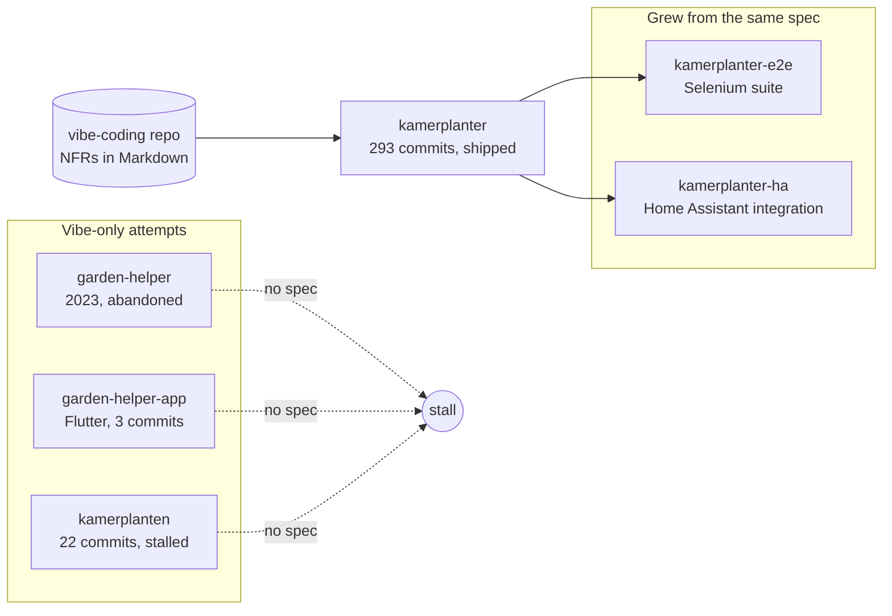

I tried to build the same app three times before it stuck. The version that shipped is [`kamerplanter`](https://github.com/nolte/kamerplanter), a self-hosted plant-management system now past 293 commits. It is the first attempt I wrote a specification for before I wrote any code. This post is about that one difference, because it turned out to be the whole experiment.

"Vibe coding" usually means the opposite: you describe a vibe, the model writes code, you nudge it until something runs. I did plenty of that. The honest result was a graveyard of half-built repos. What changed was not the model and not my prompting — it was putting a written spec in front of the vibe.

## The graveyard of false starts

The idea is old. Back in 2023 I had `garden-helper`, a small Python tool whose README still reads "Database for manage our flowers and vegetables." Next to it sat `garden-helper-app`, a Flutter client that never got past three commits and a "work in progress" note. Both are stale by years.

The plant-management idea came back in late 2025 and early 2026. I scaffolded it twice more — once as a "SmartPlant" example project, once as `kamerplanten`, a FastAPI-and-ArangoDB skeleton. The second one reached 22 commits and stopped. None of these had a Claude co-author, and none of them had a spec.

They all failed the same way. I started from a vibe, generated some plausible structure, and then stalled the moment a real decision showed up. Which database? How do errors look on the wire? What does "growth phase" even mean as data?

With no written answer, every session re-litigated the last one. The code drifted because the intent was never pinned down.

## What changed: I wrote it down first

The next time, I did not open an editor. I opened Obsidian and started a separate repo called [`vibe-coding`](https://github.com/nolte/vibe-coding) whose only job was to hold specifications. No application code lives there — just Markdown.

I wrote the requirements in character. The author field on every document says "Business Analyst - Agrotech," because that is the role I was playing while writing them. Each non-functional requirement (NFR) opens with user stories from named roles, then a business case, then acceptance criteria.

NFR-006, for example, is titled "Strukturierte API-Fehlerbehandlung mit eindeutiger Tracking-ID" — structured API error handling with a unique tracking ID. It reads like this:

```markdown
**Als** Frontend-Entwickler
**möchte ich** bei jedem API-Fehler eine eindeutige Tracking-ID
  und eine verständliche Fehlerbeschreibung erhalten
**um** Fehler schnell an das Backend-Team eskalieren zu können.
```

This felt slow and a little silly. Writing user stories for a hobby project, alone, is not the obvious move. But it forced me to answer the decisions that had killed the earlier attempts — in prose, once, before any code depended on them.

## From a spec paragraph to a Python file

Here is the part that convinced me. NFR-006 did not stop at "errors should be structured." It contained the actual Pydantic schema I wanted, descriptions and all:

```python
class ErrorResponse(BaseModel):
    error_id: str = Field(
        description="Eindeutige ID zur Nachverfolgung (Format: err_<uuid4>)"
    )
    error_code: str = Field(
        description="Maschinenlesbarer Fehlercode (z.B. VALIDATION_ERROR)"
    )
    message: str = Field(description="Menschenlesbare Fehlerbeschreibung")
    details: list[ErrorDetail] = Field(default_factory=list)
    timestamp: datetime
    path: str
    method: str
```

When I then pointed Claude at the spec and asked for the implementation, the file it wrote — `app/common/error_schemas.py` in the `kamerplanter` repo — is almost the same object:

```python
class ErrorResponse(BaseModel):
    error_id: str = Field(description="Unique tracking ID (format: err_<uuid4>)")
    error_code: str = Field(description="Machine-readable error code")
    message: str = Field(description="Human-readable error description")
    details: list[ErrorDetail] = Field(default_factory=list)
    timestamp: datetime
    path: str
    method: str
```

Notice the one real change: the descriptions are now English. That was not a slip. A different requirement, NFR-003, mandates an English source-code standard, so the German spec produced English code on purpose. Two documents, written days apart, resolved a conflict between themselves without me adjudicating it in the moment. The spec was doing the thinking I used to redo every session.

## Why the spec made the AI useful

A model is only as good as the context it works from. My earlier prototypes gave Claude a vibe and a blank repo, so it filled the gaps with plausible guesses — and plausible guesses do not agree with each other across sessions. The spec replaced the guessing with a fixed reference both of us could point at.

That stability is what let the project actually grow. The `kamerplanter` commits are co-authored with Claude Opus 4.6 and 4.7, and there are 293 of them rather than 22.

The spec also moved house: it no longer lives only in the `vibe-coding` incubator. The project carries its own `spec/` tree now, with separate folders for requirements, NFRs, architecture decisions, design, and end-to-end test cases. The specification grew up alongside the code instead of being thrown away after the first sprint.



The same approach carried into the satellites. The end-to-end tests in `kamerplanter-e2e` and the [`kamerplanter-ha`](https://github.com/nolte/kamerplanter-ha) Home Assistant integration both started from written specs, and both are co-authored the same way. Once the pattern worked once, reusing it was free.

## What it cost

I do not want to sell this as friction-free, because it was not.

Writing specs up front is real work, and some of it was wasted. A few NFRs were over-engineered for a single-user hobby app — the Kubernetes and multi-database ambitions read bigger than the problem deserves. Specs also drift: the schema above matched the code, but elsewhere the spec and the implementation have already diverged, and a stale spec is worse than none because it lies with confidence. Keeping the `spec/` tree honest is now its own chore.

The German-spec-to-English-code seam is convenient when it works and confusing when it does not. I think in German and the source standard is English, so every document sits on that fault line. And the naming is a mess I inflicted on myself: `kamerplanten`, a "kamerplanten-v2" example, then `kamerplanter` — three near-identical names for one idea is exactly the kind of thing a spec was supposed to prevent.

## What I'm keeping

The experiment answered its own question. The thing that turns a vibe into a shipped app, at least for me, is a written specification that exists before the code and lives with it afterward.

So three habits stay. I write the hard decisions down first, in prose, before I let a model touch them. I keep the spec in the repo and treat its drift as a bug. And I let Claude do the implementation while I review against the document instead of against my mood that day. The vibe is still welcome — it just no longer gets to make the architectural calls alone.
