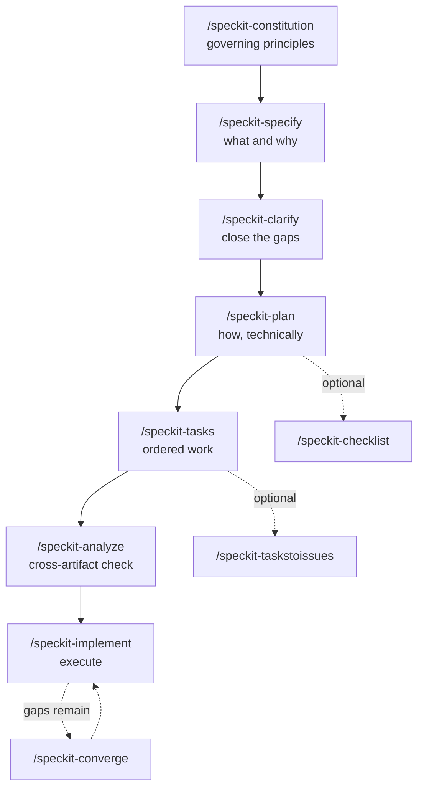

I ship 64 Claude Code skills and 60 agents out of a single repository, [`nolte/claude-shared`](https://github.com/nolte/claude-shared). Behind them sits a corpus of 114 specification topics. Adding the next skill isn't the hard part any more. Keeping the corpus and the skills honest about each other is.

That's why I spent a day on [GitHub's Spec Kit](https://github.com/github/spec-kit). It proposes a fixed command chain for turning an idea into shipped code. This post walks that chain command by command, says what each one is worth, and ends with the honest part: my spike is at step one of seven, and four assumptions are still open.

## Where I'm starting from

The skills aren't unstructured today. Every artefact class already has exactly one authoring entry point, because the entry point performs the duplicate check and the index regeneration:

| Artefact | Entry point |
| --- | --- |
| Specification under `spec/` | `/nolte-shared:spec` |
| Skill or agent | `/nolte-claude-dev:skill-management` |
| Pull request | `/nolte-shared:pull-request-create` |
| Repository scaffolding | `/nolte-shared:project-structure-apply` |

What's missing is a layer between "a spec exists" and "a skill implements it". A spec topic is a standing norm; it doesn't decompose into ordered work. So the decomposition happens in a chat session, and chat sessions aren't artefacts. Six weeks later I can read the spec and read the skill, but not the reasoning that connects them.

Spec Kit's pitch is aimed exactly there. Its README puts it as specifications that "become executable, directly generating working implementations rather than just guiding them", built on "multi-step refinement rather than one-shot code generation".

## The chain

`specify init --here` with the Claude integration writes a `.specify/` tree and ten skills into `.claude/skills/`. The Claude integration is skills-based, not command-based — `init-options.json` records `"ai_skills": true`. Because `integration.json` sets `"invoke_separator": "-"`, you invoke them as `/speckit-plan`, not `/speckit.plan`.

### `/speckit-constitution` — the gate everything else is measured against

This one writes a single file, `.specify/memory/constitution.md`, holding the project's non-negotiables. I ran it, and it's the only step I've finished. The result is version 1.0.0, ratified today, with five principles:

1. **Spec-Anchored Change** — every change to runtime code, CI, plugin assets, or docs must implement an existing spec or be a spec revision itself.
2. **English-Canonical Bilingual Parity** — translations are written in the same authoring step, never a follow-up commit.
3. **Isolated Working Copies** — the primary checkout stays on `develop`; every change happens in a worktree.
4. **Green Gate Before Merge** — `task check` runs identically locally and in CI.
5. **Distribution-Contract Plugin Scoping** — a plugin split needs a different consumer audience or runtime requirement, never topic affinity.

**What it's worth:** the value isn't the file. It's that `plan-template.md` carries a `Constitution Check` gate marked *"Must pass before Phase 0 research. Re-check after Phase 1 design."* — so every later plan gets measured against those five principles twice. A violation that must ship anyway lands in a **Complexity Tracking** table with its justification and the rejected simpler alternative. That's the part I couldn't buy anywhere else: a written record of why the shortcut was taken.

The command also emits a Sync Impact Report naming which dependent artefacts need updating. Mine cleared three templates, the ten rendered skills, and both runtime guidance files as already consistent — no deferred work.

### `/speckit-specify` — the what, before any how

Takes a natural-language feature description and writes `specs/NNN-<slug>/spec.md`. The template's mandatory sections are User Scenarios & Testing, Requirements, Success Criteria, and Assumptions.

**What it's worth:** it forces the separation I keep collapsing by hand. When I write a skill straight from a spec topic, the "what" and the "how" arrive in the same paragraph — and the "how" wins. A file with nowhere to put implementation detail is a cheap forcing function.

**What it doesn't solve for me:** these feature specs aren't my `spec/` corpus. Spec Kit has no concept of a standing norm held separately from feature specs, and its own monorepo guide is blunt about the related gap: "Spec Kit does not provide a built-in base/inheritance mechanism." The advice there — "duplicate or sync shared engineering rules per project" — is the exact problem `claude-shared` exists to solve. My constitution therefore says it outright: `.specify/` holds workflow scaffolding, the `spec/` corpus stays the normative authority, and one of those two layers is disposable.

### `/speckit-clarify` — up to five targeted questions

Reads the current feature spec, finds underspecified areas, asks at most five questions, and writes the answers back into the spec.

**What it's worth:** it's the cheapest step in the chain and the one I'd most regret skipping. The answers land in the file rather than the chat scrollback — precisely the artefact I said was missing.

### `/speckit-plan` — how, with the constitution watching

Produces `plan.md` plus design artefacts — research notes, a data model, a quickstart, contracts.

**What it's worth:** the double Constitution Check. My spike's assumption **A4** asks whether that gate survives a roughly 200-line constitution plus pointers into a 114-topic corpus, or whether it blows the plan's context budget. If it holds, I get an automated conscience on every plan. If it doesn't, I have to cut to eight principles or fewer and keep the rest purely referential.

### `/speckit-tasks` — ordered, parallel-aware work

Generates `tasks.md`: dependency-ordered tasks in phases (Setup, Foundational, one phase per user story, Polish). Each line carries a `[P]` marker when it can run in parallel and a `[US1]`-style tag binding it to a story.

**What it's worth:** the parallel markers are the concrete win. I already run parallel worktrees as a matter of course. Today I decide by hand which two pieces of work can safely run side by side. A generated `[P]` marker turns that judgement call into something reviewable.

### `/speckit-analyze` — the consistency pass I don't have

A non-destructive cross-artifact check across `spec.md`, `plan.md`, and `tasks.md`, run after task generation.

**What it's worth:** this is the step with no equivalent in my current setup. I have `spec-drift-audit` for spec-versus-code drift, but nothing that checks whether a plan still matches the spec it came from before any code is written. Catching that at the artefact stage is much cheaper than catching it at review.

### `/speckit-implement` — execute the list

Works through `tasks.md`. The bundled workflow, `.specify/workflows/speckit/workflow.yml`, wires the chain as `specify → review-spec gate → plan → review-plan gate → tasks → implement`. Both gates are human approve-or-abort.

**What it's worth:** honestly, the least of the seven for me. By the time a task list is that specific, my existing skills already do the work well. The value accumulated in the six steps before it.

### The three optional ones

`/speckit-checklist` generates a domain-specific quality checklist. `/speckit-taskstoissues` converts tasks into GitHub issues. `/speckit-converge` re-reads the codebase, compares it against spec, plan, and tasks, and appends whatever is still unbuilt back onto `tasks.md`. The last one is the interesting one: it's a recovery path for a half-finished feature, which is the state most of my abandoned branches are actually in.

## Where the spike actually stands

Two commits on an `exp/speckit-spike` branch. One scaffolds Spec Kit 0.14.3, one ratifies the constitution. That's it. Steps two through seven haven't run against my skills, and I'm not going to pretend otherwise.

The spike exists to falsify four assumptions before any migration starts:

- **A1** — does `specify extension add` copy a whole extension tree, or only files declared under `provides:`? The schema knows `commands` and `config`, and nothing else. A 114-topic corpus can't be declared there. This is the hardest assumption in the whole plan; if it falls, the corpus has no home in an extension and needs separate transport.
- **A2** — does my skill frontmatter survive rendering into `.claude/skills/`? A rendered core skill carries exactly `name`, `description`, `argument-hint`, `compatibility`, `metadata`, `user-invocable`, `disable-model-invocation`. None of my routing fields — `use_when`, `tags`, `phase`, `summary_de` — appear. That isn't yet proof they get dropped, since a core command never had them. `metadata` is a free-form nested map and a plausible carrier.
- **A3** — is `/speckit.nolte-media.image-generate` ergonomically bearable next to today's `/nolte-media:image-generate`?
- **A4** — does the Constitution Check carry a constitution that size, as described above?

One finding arrived before the work even started, and it's worth passing on. Running `specify --version` inside the worktree triggered a full `specify init --here`: a complete `.specify/` tree plus ten skill files, from what looked like a read-only call. The primary checkout was untouched, and the artefacts were removed afterwards. Still — never call `specify` without a deliberately set working directory.

## What I think so far

The chain isn't competing with my specs. It's a layer on top of them. Two steps I'd keep even if the migration never happens: `clarify` and `analyze` — the two that produce artefacts I currently reconstruct from memory.

What the tool doesn't offer is equally clear, and none of it is a defect on its part: no standing norm corpus separate from feature specs, no spec inheritance, no internationalisation, no subagent primitive. My corpus is bilingual and 60 of my 124 artefacts are agents. Those four gaps are the whole reason this is a spike and not a migration.

The next post on this will either report four answered assumptions or a dropped idea. Both are a result.
